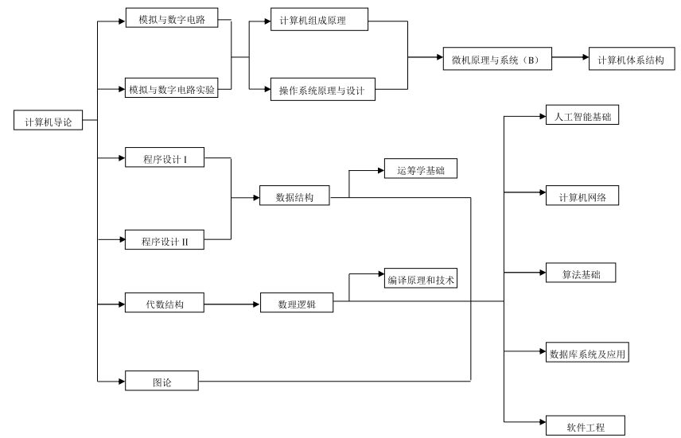

<head>
    <meta http-equiv="content-type" content="text/html; charset=utf-8">
    <link rel="stylesheet" href="https://use.fontawesome.com/releases/v5.8.1/css/all.css" integrity="sha384-50oBUHEmvpQ+1lW4y57PTFmhCaXp0ML5d60M1M7uH2+nqUivzIebhndOJK28anvf" crossorigin="anonymous">
    <title> 中国科学技术大学课程资源</title>
</head>
# 中国科学技术大学课程资源

  <h2>
    <a href="../index.html">&nbsp;&nbsp;<i class="fas fa-backward"></i>&nbsp;</a>
    :/<a href="../index.html"><i class="fas fa-home"></i></a>/
  </h2>

## 说明
- 列表根据拼音排序
- 点击 Files 的链接下载二进制文件
- 或者打开文本文件(markdown 文件经过渲染)

<h2> Directories &nbsp; <a href="https://download-directory.github.io/?url=https://github.com/USTC-Resource/USTC-Course/tree/master/" style="color:red;text-decoration:underline;" target="_black"><i class="fas fa-download"></i></a></h2>

<ul><li><a href="编译原理和技术/index.html"><i class="fas fa-folder"></i>&nbsp;编译原理和技术</a></li>
<li><a href="操作系统原理与设计/index.html"><i class="fas fa-folder"></i>&nbsp;操作系统原理与设计</a></li>
<li><a href="c程序设计/index.html"><i class="fas fa-folder"></i>&nbsp;c程序设计</a></li>
<li><a href="代数结构/index.html"><i class="fas fa-folder"></i>&nbsp;代数结构</a></li>
<li><a href="概率论与数理统计/index.html"><i class="fas fa-folder"></i>&nbsp;概率论与数理统计</a></li>
<li><a href="光学与原子物理/index.html"><i class="fas fa-folder"></i>&nbsp;光学与原子物理</a></li>
<li><a href="Java软件开发基础/index.html"><i class="fas fa-folder"></i>&nbsp;Java软件开发基础</a></li>
<li><a href="近世代数/index.html"><i class="fas fa-folder"></i>&nbsp;近世代数</a></li>
<li><a href="计算方法/index.html"><i class="fas fa-folder"></i>&nbsp;计算方法</a></li>
<li><a href="计算机图像学/index.html"><i class="fas fa-folder"></i>&nbsp;计算机图像学</a></li>
<li><a href="计算机网络/index.html"><i class="fas fa-folder"></i>&nbsp;计算机网络</a></li>
<li><a href="计算机系统详解/index.html"><i class="fas fa-folder"></i>&nbsp;计算机系统详解</a></li>
<li><a href="计算机组成原理/index.html"><i class="fas fa-folder"></i>&nbsp;计算机组成原理</a></li>
<li><a href="马克思主义基本原理概论/index.html"><i class="fas fa-folder"></i>&nbsp;马克思主义基本原理概论</a></li>
<li><a href="模拟与数字电路/index.html"><i class="fas fa-folder"></i>&nbsp;模拟与数字电路</a></li>
<li><a href="数据结构/index.html"><i class="fas fa-folder"></i>&nbsp;数据结构</a></li>
<li><a href="数理方程/index.html"><i class="fas fa-folder"></i>&nbsp;数理方程</a></li>
<li><a href="数理逻辑/index.html"><i class="fas fa-folder"></i>&nbsp;数理逻辑</a></li>
<li><a href="算法基础/index.html"><i class="fas fa-folder"></i>&nbsp;算法基础</a></li>
<li><a href="随机过程/index.html"><i class="fas fa-folder"></i>&nbsp;随机过程</a></li>
<li><a href="Web-信息处理与应用/index.html"><i class="fas fa-folder"></i>&nbsp;Web-信息处理与应用</a></li>
<li><a href="微机原理与系统/index.html"><i class="fas fa-folder"></i>&nbsp;微机原理与系统</a></li>
<li><a href="自然语言处理/index.html"><i class="fas fa-folder"></i>&nbsp;自然语言处理</a></li></ul>

## Files
<ul><li><i class="fas fa-meh"></i>&nbsp;None</li></ul>

---

  <a href="https://github.com/USTC-Resource/USTC-Course.git" target="_blank" rel="external"><i class="fab fa-github"></i>&nbsp; GitHub</a>
  <a href="mailto:&#122;huheqin1@gmail.com?subject=反馈与建议" style="float:right" target="_blank" rel="external"><i class="fas fa-envelope"></i>&nbsp; Feedback</a>

---

<h1 style="color:red;text-align:center;">Read Me</h1>

<h1 id="_1">中国科学技术大学课程资源</h1>

<blockquote>
<blockquote>

本仓库收录中国科学技术大学众多课程资源的笔记，总结，经验等<strong>学生原创内容</strong>

</blockquote>
</blockquote>
<h1 id="_2">目录索引</h1>
<ul>
<li><a href="#版权说明">版权说明</a></li>
<li><a href="#反馈方式">反馈方式</a></li>
<li><a href="#资料下载">资料下载</a></li>
<li><a href="#课程结构">课程结构</a></li>
<li><a href="#课程关系">课程关系</a></li>
<li><a href="#课程目录">课程目录</a></li>
<li><a href="#贡献投稿">贡献投稿</a></li>
</ul>
<h1 id="_3">版权说明</h1>

本仓库分享资料遵守其创作者之规定, 由同学自愿投稿，仅接收学生原创的或者获得授权的资源。

对无特别声明的资料，谨以<a href="http://creativecommons.org/licenses/by-nc-sa/4.0/">知识共享署名 - 非商业性使用 - 相同方式共享 4.0 国际许可协议</a> 授权。

请创作者及公众监督，如有资料违反许可协议，请告知我们改正错误。

<h1 id="_4">反馈方式</h1>
<ul>
<li><a href="https://github.com/USTC-Resource/USTC-Course/issues/new">issue</a></li>
<li><a href="mailto:&#122;huheqin1@gmail.com?subject=USTC-Course-FeedBack">email</a></li>
</ul>
<h1 id="_5">资料下载</h1>

<a href="https://ustc-resource.github.io/USTC-Course">戳我(●'◡'●)</a>

<h1 id="_6">课程结构</h1>

每门课程大致结构如下，有些栏目可能没有，也可以自己添加认为合理的栏目

<pre class="codehilite"><code>course
├ codes
│   ├ mbinary0
│   ├ mbinary1
│   └ mbinary2
├ labs
├ exams
├ notes
└ README.md
</code></pre>

<h1 id="_7">课程关系</h1>

更多信息可以下载<a href="https://www.teach.ustc.edu.cn/education/241.html/attachment/14-215%E8%AE%A1%E7%AE%97%E6%9C%BA%E5%AD%A6%E9%99%A2-2013">官网的培养方案</a>

<h1 id="_8">课程目录</h1>

<strong>根据拼音字母排序</strong>, 可以通过在此页面搜索课程名快速定位。

<ul>
<li><a href=".">.</a><ul>
<li><a href="./编译原理和技术">编译原理和技术</a></li>
<li><a href="./操作系统原理与设计">操作系统原理与设计</a></li>
<li><a href="./c程序设计">c程序设计</a></li>
<li><a href="./代数结构">代数结构</a></li>
<li><a href="./概率论与数理统计">概率论与数理统计</a></li>
<li><a href="./光学与原子物理">光学与原子物理</a></li>
<li><a href="./Java软件开发基础">Java软件开发基础</a></li>
<li><a href="./近世代数">近世代数</a></li>
<li><a href="./计算方法">计算方法</a></li>
<li><a href="./计算机图像学">计算机图像学</a></li>
<li><a href="./计算机网络">计算机网络</a></li>
<li><a href="./计算机系统详解">计算机系统详解</a></li>
<li><a href="./计算机组成原理">计算机组成原理</a></li>
<li><a href="./马克思主义基本原理概论">马克思主义基本原理概论</a></li>
<li><a href="./模拟与数字电路">模拟与数字电路</a></li>
<li><a href="./数据结构">数据结构</a></li>
<li><a href="./数理方程">数理方程</a></li>
<li><a href="./数理逻辑">数理逻辑</a></li>
<li><a href="./算法基础">算法基础</a></li>
<li><a href="./随机过程">随机过程</a></li>
<li><a href="./Web-信息处理与应用">Web-信息处理与应用</a></li>
<li><a href="./微机原理与系统">微机原理与系统</a></li>
<li><a href="./自然语言处理">自然语言处理</a></li>
</ul>
</li>
</ul>
<h1 id="_9">贡献投稿</h1>
<blockquote>

感谢您的贡献 :smiley:

</blockquote>
<ul>
<li>仅接受学生原创的或者获得授权的资源</li>
<li>GitHub 上不能直接上传大于 100Mb 的文件。对于超过 100 Mb 的文件，可以存在网盘，然后在 README.md 中贴上链接</li>
<li>文件内容的改动会使 git 重新上传, 在没有必要的情况下, 不要对二进制文件做任何更改.</li>
</ul>
