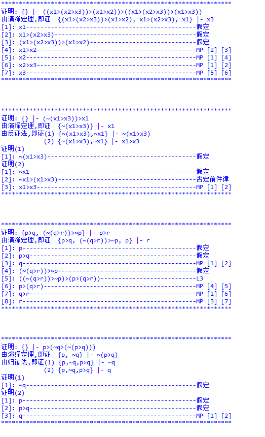

>写的一个简单的脚本实现 在 L 下的公式证明, 有兴趣的同学可以看看, 算是抛砖引玉吧

# system-L

## Descripton
it's a formal logic deduction based on system-L
### symbols
`~` , `->`  (in the script, i use > to repr it)
### rules
The basic three axioms:
* L1: `p->(q->p)`
* L2: `(p->(q->r)) -> ((p->q)->(p->r))`
* L3: `~q->~p -> (p->q)`

### deduction
{p,p->q} |- q

you can read the professional [book](src/mathematical-logic.pdf)
or click [here](https://en.wikipedia.org/wiki/Mathematical_logic) to see more details 

## Idea
To prove one proposition:
* Firstly, I use deduction theorem(演绎定理) to de-level the formula and finally get a prop varible or a prop in form of `~(...)`. let's  mark it as p or ~p
* Next, I create a set `garma` and fill it with  some generated  formulas using the three axioms(公理),some theorem and conclusions.
* Then, I search p or ~p in `garma, or further, using modus ponent(MP) to deduct  p or ~p.
* Finally, if using mp can't prove it, I will use `Proof by contradiction`(反证法) to prove it.

## Requirement
python modules
* sympy

## Visual

## To do
* 将证明过程对象化,便于处理,打印(英文版,中文版),
* 其他连接词的转换
* 处理简单的, 有一定模式的自然语言, 形成命题推理

## Contact
* mail: zhuheqin1@gmail.com
* QQ  : 414313516
