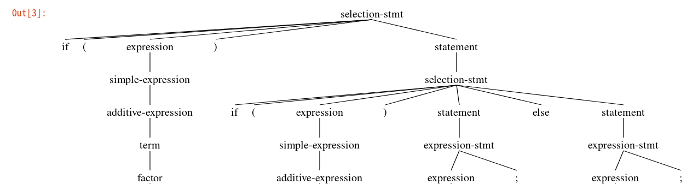
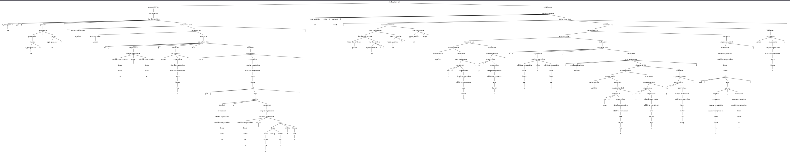
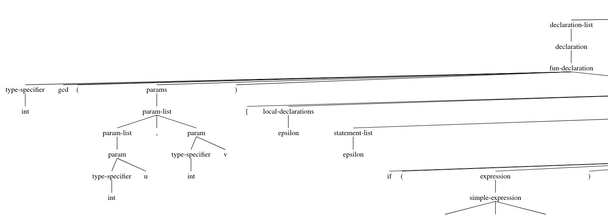

# Lab2 report

Yimin Gu

PB17000002

File created on 2019.10.9

Last modified 2019.10.15

## Main ideas & implementation

The task of lab2 is to generate a syntax tree from C- source file using bison.

The main process: 

```
tokens analyzed from file by flex
|
tokens are given to bison
|
bison does conduction by rules, meanwhile building the tree by actions
|
print the tree, and misc. jobs
```

As the parser is going to get token stream from result generated by flex, I choose to let flex initialize tree nodes(more precisely, tree leaf tokens), and use bison action rules to generate other nodes and add those leaf tokens to the tree. 

I use union which contains a `SyntaxTree * node` to share data structure between bison and flex. For each valid token found by flex, a node(leaf) is created. For each rule like `A -> B C D` in bison, a node is created for `A`, and `B`, `C` and `D` are added as children of `A`. So after doing all the reduction, a whole syntax tree is generated, with `program` in the first statement containing the tree root. 

## Shift-reduce conflict in if-else statement

The given syntax about C- contains a shift-reduce conflict (and bison gives a warning): 

selection-stmt → `if` `(` expression `)` statement | `if` `(` expression `)` statement `else` statement

We don't know whether to shift in `else` or reduce using the first part of the rule. 

To solve this, we can figure out better rules(maybe adding more statements) or give the shift and reduce an priority. Here I used the method discussed on GitLab(by iBug and Ray-Lei) and [stackoverflow](https://stackoverflow.com/questions/12731922/reforming-the-grammar-to-remove-shift-reduce-conflict-in-if-then-else): tell the parser to shift in `else` when the conflict occurs. And `else` will be binded to the closest `if`. 

After this, the conflict is solved and we can see from the syntax tree that the behavior is same as expected.

Picture: a part of a syntax tree, showing how `if() if() else` is parsed. 



## (Lamed) visualization

To show the procedure of tree-building, the tree should be printed during analysis. I print the tree using the node for the left non-terminal as the tree root. So the tree at the current time is printed, and we can see how the tree grows when more reductions are made. But this is a really lamed solution, because during analysis, the tokens actually form a **forest** instead of a single **tree**, and printing the single tree only shows the newly analyzed fraction of the whole picture. 

And how to visualize the tree? I first tried LaTeX, but later find python to be a better tool. I used a package called `svgling` which can draw trees. I wrote a function to generate a python script and print those trees in the `svgling` format(using a modified function like `printSyntaxTreeNode`). Then run the python script in jupyter, and we can see all those(some of them really big) trees. Like the example `syntree/trees.ipynb`

The result of the final tree is really good, as is shown below.

To avoid messing up with existing code(and output), I defined macros TREE_GEN_TEXT and TREE_GEN_GRAPH, only when these macros are defined will the python scripts be generated. 

A shot of the final of the gcd.cminus tree(the original svg picture is more than 6000 pixel in width):



First subtree in gcd:




## TODO & further improvement?

(This is solved by introducing an extra function to judge whether LAB1_ONLY is defined and then choose to return token or not.)

~~To avoid useless tokens like `COMMENT` or `NEWLINE`, I just remove actions which are related to these tokens in flex because I didn't find a better solution. So parts of the code in lab1 is modified and deleted, though I made backup, this makes the program somewhat less backward compatible.~~ 

Also, I didn't find any better way(after searching on the Internet and consulting students) to write the actions in bison(those to build tree) in an elegant way. You can find that the code in `syntax_analyzer.y` is really in bad condition, codes are repetitious and long thus difficult to maintain. Though recording editor macros and replacing with (complex) regular expression in VIM make the work easier, I still found this process disturbing. 

The visualization is lamed, and better way is needed, though I think further work(maybe even animation) on this won't be easy. 

I feel that my whole project is a little bit messy, but don't know what to do about it :-(

**An attempted git repo cleanup**

I misunderstood the instruction in lab1 and put the labs in my homework repository. So choose to rename the repository and remove those homework folders and commits. This turns out to be very hard. I'm not good enough at git to handle these rebase and cherrypick, even modifing an old commit message turns out to be extremely hard for me. 

What I can do is to delete all HW* folders using filter-branch. Now the repo is cleaner but there are still garbage here and there, maybe half a sentence in a commit message or an unexpected merge. 

## Final result & summary

So the result is good: required parts are done, and at least a visualized tree can be seen. 

Take the `gcd` as an example: 

The syntax tree is as expected.

```
>--+ program
|  >--+ declaration-list
|  |  >--+ declaration-list
|  |  |  >--+ declaration
|  |  |  |  >--+ fun-declaration
|  |  |  |  |  >--+ type-specifier
|  |  |  |  |  |  >--* int
|  |  |  |  |  >--* gcd
|  |  |  |  |  >--* (
|  |  |  |  |  >--+ params
|  |  |  |  |  |  >--+ param-list
|  |  |  |  |  |  |  >--+ param-list
|  |  |  |  |  |  |  |  >--+ param
|  |  |  |  |  |  |  |  |  >--+ type-specifier
|  |  |  |  |  |  |  |  |  |  >--* int
|  |  |  |  |  |  |  |  |  >--* u
|  |  |  |  |  |  |  >--* ,
|  |  |  |  |  |  |  >--+ param
|  |  |  |  |  |  |  |  >--+ type-specifier
|  |  |  |  |  |  |  |  |  >--* int
|  |  |  |  |  |  |  |  >--* v
|  |  |  |  |  >--* )
|  |  |  |  |  >--+ compound-stmt
|  |  |  |  |  |  >--* {
|  |  |  |  |  |  >--+ local-declarations
|  |  |  |  |  |  |  >--* epsilon
|  |  |  |  |  |  >--+ statement-list
|  |  |  |  |  |  |  >--+ statement-list
|  |  |  |  |  |  |  |  >--* epsilon
|  |  |  |  |  |  |  >--+ statement
|  |  |  |  |  |  |  |  >--+ selection-stmt
|  |  |  |  |  |  |  |  |  >--* if
|  |  |  |  |  |  |  |  |  >--* (
|  |  |  |  |  |  |  |  |  >--+ expression
|  |  |  |  |  |  |  |  |  |  >--+ simple-expression
|  |  |  |  |  |  |  |  |  |  |  >--+ additive-expression
|  |  |  |  |  |  |  |  |  |  |  |  >--+ term
|  |  |  |  |  |  |  |  |  |  |  |  |  >--+ factor
|  |  |  |  |  |  |  |  |  |  |  |  |  |  >--+ var
|  |  |  |  |  |  |  |  |  |  |  |  |  |  |  >--* v
|  |  |  |  |  |  |  |  |  |  |  >--+ relop
|  |  |  |  |  |  |  |  |  |  |  |  >--* ==
|  |  |  |  |  |  |  |  |  |  |  >--+ additive-expression
|  |  |  |  |  |  |  |  |  |  |  |  >--+ term
|  |  |  |  |  |  |  |  |  |  |  |  |  >--+ factor
|  |  |  |  |  |  |  |  |  |  |  |  |  |  >--* 0
|  |  |  |  |  |  |  |  |  >--* )
|  |  |  |  |  |  |  |  |  >--+ statement
|  |  |  |  |  |  |  |  |  |  >--+ return-stmt
|  |  |  |  |  |  |  |  |  |  |  >--* return
|  |  |  |  |  |  |  |  |  |  |  >--+ expression
|  |  |  |  |  |  |  |  |  |  |  |  >--+ simple-expression
(following output omitted)
```

And all the trees generated can be seen in `treegraph/trees.ipynb`. (Seems the trees can not be seen when the ipynb is viewed directly in gitlab, viewing in pycharm or jupyter is fine)

In this lab I continuously met problems about C header file and variable declaration/definition. Some of these is caused by my unfamiliar with cmake and misunderstanding of TAs' code, and most others is because I'm not good at dealing with these kind of problems. After this, I feel my debugging skill is better. 

Also, I'm more confident when merging git conflicts. 

## Feedback?

[Deleted]

# Timing

~1.5h get familiar with what to do

~1h learn bison

~0.5h try to learn cmake

~0.5h modify the flex parts

~1.5h write the bison parts(including solving bison problems)

~1h solving small problems and debugging

~2h visualization

~3h code cleanup, and report. 