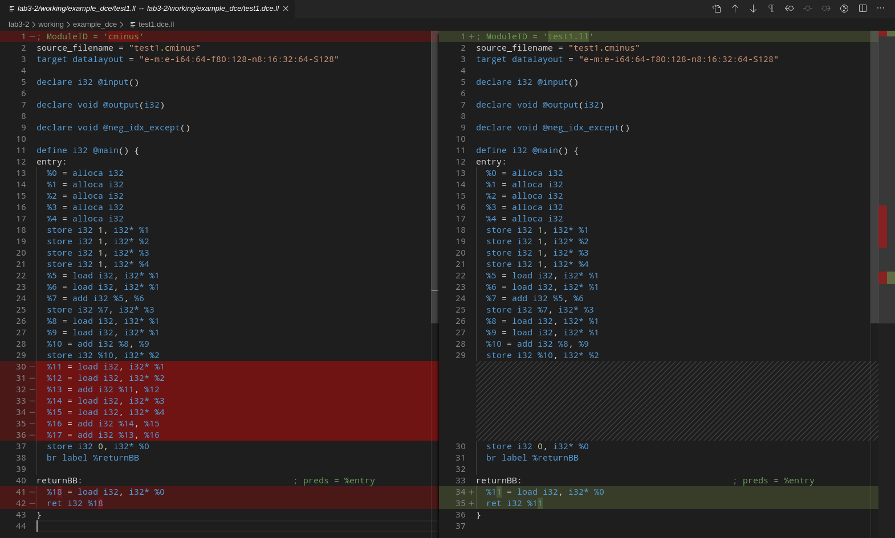
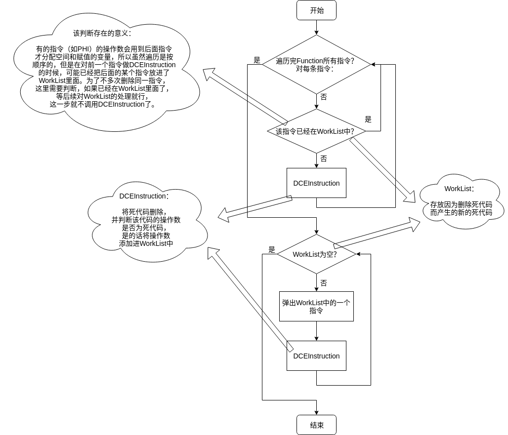
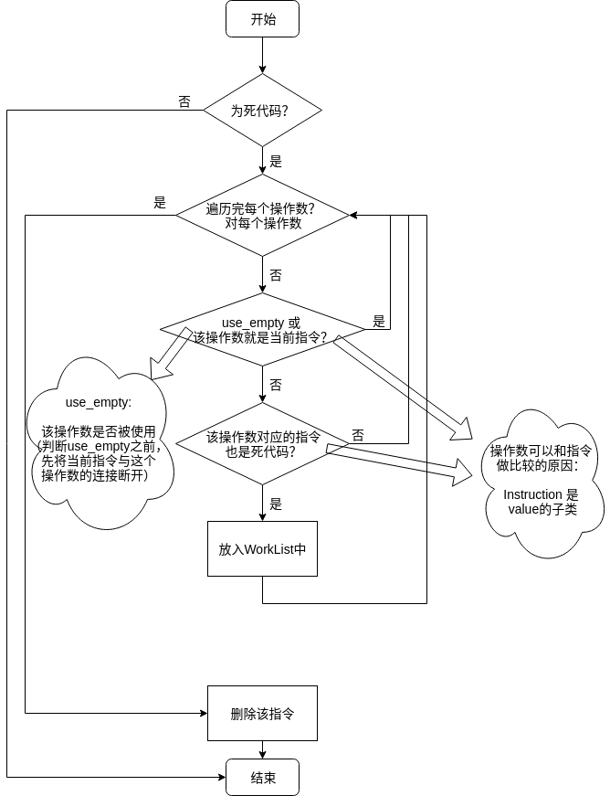
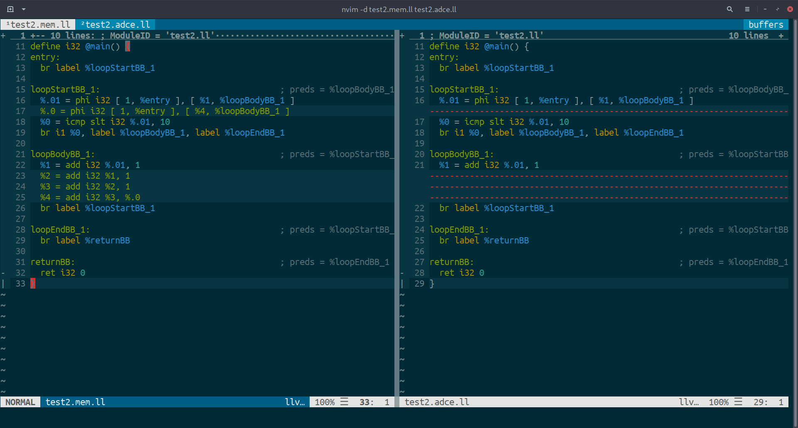
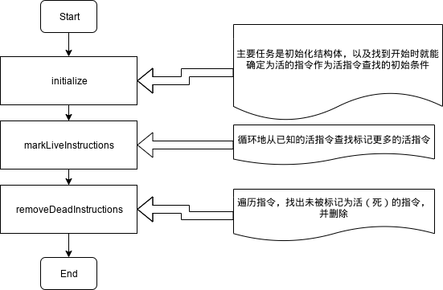
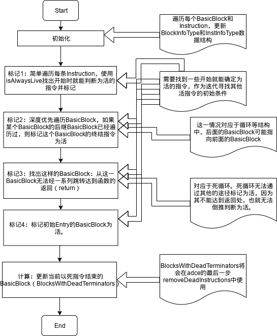
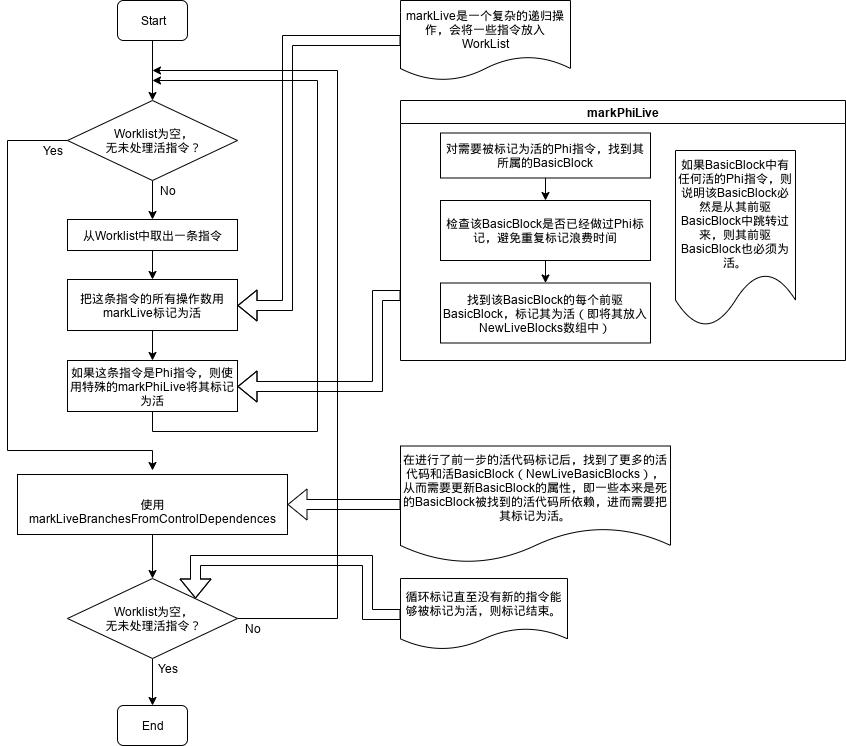
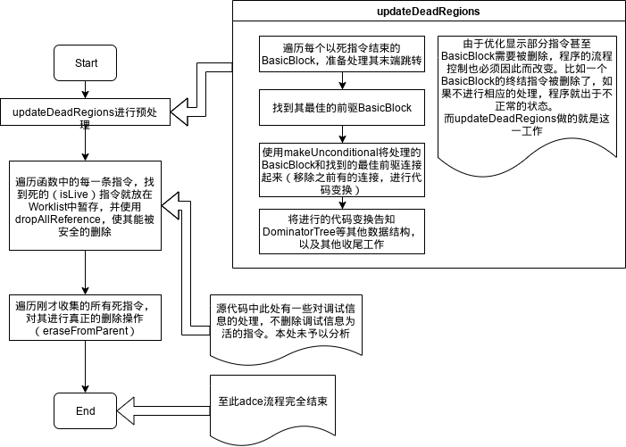

# lab3-2实验报告

小组成员 姓名 学号  
PB17000002 古宜民（队长）  
PB15081586 苏文治  
PB16001837 朱凡  


## 实验要求

通过阅读相关源代码和从LLVM官方文档中了解相关信息等，学习选定的LLVM Pass并完成报告，介绍其类型、作用、优化细节和运行流程。

## 报告内容

### Pass: dce(Dead Code Elimination)

#### 类型与作用

dce是一个较为简单的删除明显是死代码的pass，他先遍历function中的每条指令，将死指令删除，然后重新反复检查指令，寻找因为删除死指令后新出现的死代码，并删除。

#### LLVM IR优化效果

cminus程序：

```c
int main(void) {
	int a;
	int b;
	int c;
	int d;
	a = 1;
	b = 1;
	c = 1;
	d = 1;
	c = a + a;
	b = a + a;
	(a + b) + (c + d);
	return 0;
}
```

直接生成LLVM IR与经过dce优化后的对比：



可以看到，变量`%17`计算后没有使用，故`%17 = add i32 %13, %16`是死代码，先删除这一行代码。删除这一行后，dce继续检查，会发现`%16`计算后也没有使用，故`%16 = add i32 %14, %15`也是死代码，删除这一行，如此反复进行，直到`%11`-`%17`都被删除。

#### 流程

**主体流程**如下：

1.遍历找出死代码 -> 2.删除该死代码 -> 3.寻找因为删除该死代码出现的新的死代码，并加入WorkList中 -> 4.删除WorkList中的死代码，并重复步骤3



**核心函数**（删除死代码函数）流程如下：

1.判断当前指令是不是死代码，不是则直接结束 -> 2.对该指令的每个操作数，判断如果去除该指令后是不是死代码，如果是则添加进WorkList中 -> 3.删除该指令



### Pass: adce(Advanced Dead Code Elimination)

#### 类型和作用

adce同样是一个死代码删除的Pass。相对于dce直接找出死代码并删除，adce更加激进，其首先假设所有代码都是死的，再通过推导和分析找出活的代码，没有证明是活的代码会被删除。

#### LLVM IR优化效果

实验中发现，如果不使用`mem2reg`等其他Pass，很难找到adce能优化但dce不能优化的例子。于是本处使用一个经`mem2reg`优化的例子。

cminus程序：

```c
int main(void) {
	int a;
	int b;
	int c;
	int d;
	a = 1;
	b = 1;
	c = 1;
	d = 1;
	while(a < 10) {
		a = a + 1;
		d = a + b + c + d;
	}
	return 0;
}
```

只有`mem2reg`和`mem2reg`并`adce`的IR对比（`mem2reg`后`dce`没有任何效果就没有展示；为了对比方便这里放了vimdiff图片，IR代码在example_adce目录中）：



可见，adce成功地消除了循环中对变量`d`计算的代码，因为变量d在循环中计算后并未使用。

代码中，对变量`d`的计算分散在两个部分，即循环体中的计算和循环开始处初始值计算的Phi指令。由于两处指令互相引用了结果，`%4`计算中用了`%.0`，而`%.0`的计算中也用了`%4`，所以直接看上去两条代码都被其他指令引用，都不是死代码，dce也就无法删除。

但是adce通过整体分析，由于没有其他对变量`d`的引用，`%.0`和`%4`的两条指令（以及`%2`，`%3`两条计算指令）也就无法被标记为活，于是在adce中一起被删除。

从这个简单的循环例子可见，正如文档所说，adce在循环中可以找到其他dce无法找到的死代码。

#### 流程

**overview**

adce作用于Function，对Function中的每个BasicBlock和每条Instruction安排了结构体`BlockInfoType`和`InstInfoType`用于记录代码的信息。类`AggressiveDeadCodeElimination`记录了分析的数据并定义了各种分析函数和辅助函数。

adce的整体思路是，先在待优化的代码片段中找出开始就能确定为活的指令（比如函数开始entry的第一条指令、函数最后返回的指令等），再和dce类似，由已知的活指令，以大致和执行顺序相反的顺序，不断地反向寻找由已知活指令能推导出为活的指令（比如一条活指令的操作数为活，如果一个BasicBlock为活，那么它的最后一条控制流转移指令也为活）。并且为了得知程序流程的转移过程，adce中的很多部分是以BasicBlock为单位进行分析的。

adce主要流程分为3步：



**具体流程**

initialize



markLiveInstructions，是相对重要和复杂的过程




removeDeadInstructions，进行代码分析后的删除工作



**重要函数细节**

整个流程中一个重要的函数是markLive，其有两个，分别用于标记Instruction和BasicBlock。流程如下：


## 实验总结

本次实验我们体会了阅读大项目源代码，遇到了一些困难，也获得了很大的收获和经验。

我们发现源码中使用了各种各样的C++特性和方便的自定义的数据结构，整体代码风格非常好，我们感到自己的C++水平有待提升。

虽然LLVM的代码注释很丰富，但我们发现仅仅阅读了注释后，仍然不能很好的把握代码的含义。而很多库函数在文档上也没能找到资料，找到函数实现处的代码又难以看懂，一些细节函数（比如depth_first_ext等）在stackoverflow上也没有任何人提问，只能通过函数名猜测功能。在反复阅读代码后，我们较为深入的理解了DCE的流程，大致理解了ADCE的流程。对于ADCE，我们只知道代码做了什么，而还没有完全明白为什么这么做能够保证正确性：为什么初始条件设置的足够，不多也不少？为什么能保证markLive复杂的递归调用能够不出偏差的完成任务？为什么有时候要加一些如是否是UnconditionalBranch这类判断条件，这些条件在哪里体现处必要性？这些问题还需要有机会继续研究。

本次实验中我们也尝试了一些工具的使用。我们最开始的想法是在一个云IDE上合作阅读代码，个人随看随添加注释，以便于理解。但后来发现我们自己搭建的云IDE效果并不是很理想，并且相互讨论研究代码的效果远远好过看别人写的注释，于是就没有继续使用。在流程图绘制上，开始尝试了使用markdown的一些特性，比如flow绘制流程图，但功能极其有限，并且无法直接在Gitlab的markdown中展示。于是选用了[draw.io](https://www.draw.io)进行流程图绘制，效果很好。

## 实验反馈

对本次实验的建议（可选 不会评分）
