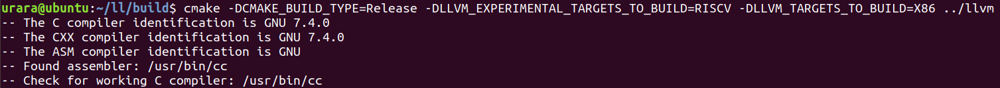
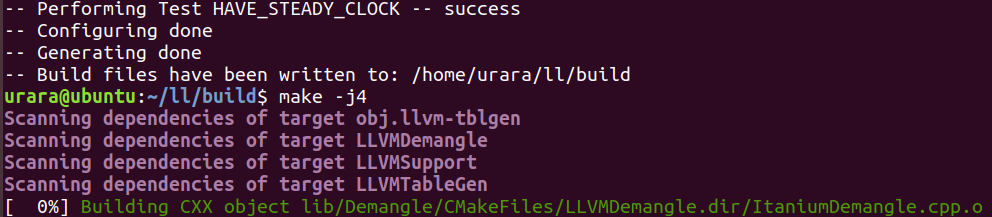
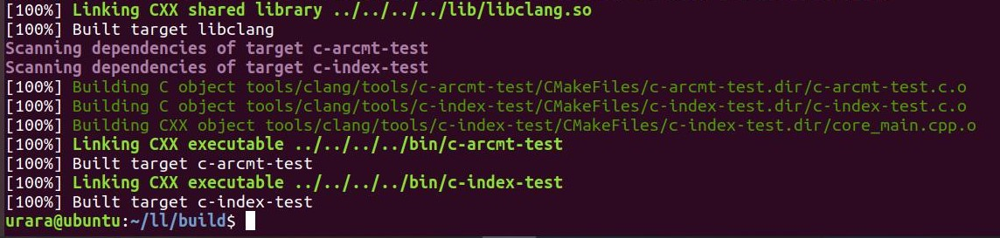
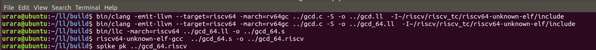
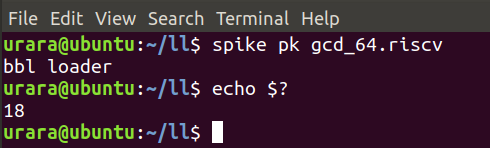

# lab4实验报告

PB17000002 古宜民（队长）

PB15081586 苏文治

PB16001837 朱凡

## 实验要求

1. RISC-V 机器代码的生成和运行

    - 重新编译LLVM使得LLVM支持RISC-V
    - 生成RISC-V源码
    - 使用模拟器运行RISC-V源码

2. LLVM源码阅读与理解

    - 阅读RegAllocFast.cpp，了解文件执行流程，并关注几个重点函数和变量的作用
    - 与龙书的寄存器分配算法比较，分析不同点

## 报告内容

#### 1. RISC-V 机器代码的生成和运行

- LLVM 8.0.1适配RISC-V

  如图，根据文档重新编译使得LLVM 8.0.1适配RISC-V：
  
  
  ...
  
  ...
  

- lab3-0 GCD样例 LLVM IR 生成 RISC-V源码的过程

  预先完成riscv-gnu-toolchain的编译安装，感谢issues#259中提供的源代码压缩包;之后如图根据文档先使用clang和llc对GCD样例程序生成汇编，接着使用riscv版的gcc对其生成执行程序，这一步之前需将riscv-gnu-toolchain的安装路径/bin加入PATH中：
  
  

- 安装 Spike模拟器并运行上述生成的RISC-V源码

  预先由github得到riscv-pk和riscv-isa-sim(spike模拟器)的源码，并编译安装在和riscv-gnu-toolchain同一路径下，并且除上一步中已加入的路径，还需将riscv-gnu-toolchain的安装路径/riscv64-unknown-elf/bin即pk可执行文件所在路径加入PATH中或直接在命令中指定；接着根据文档调试上一步得到的可执行文件如图，成功执行：
  
  

#### 2. LLVM源码阅读与理解

- RegAllocFast.cpp 中的几个问题

  * *RegAllocFast* 函数的执行流程？

    答：
    
    *RegAllocFast* 是对 Machine IR 执行的，Machine IR 比 IR 更底层，可能同时存在虚拟寄存器与物理寄存器。
    
    虚拟寄存器是代表物理寄存器的符号，但不一定和物理寄存器一一对应，如平时写的.ll文件中，%0 %1之类的即为虚拟寄存器。物理寄存器是与机器相关的实际存在的寄存器。*RegAllocFast*主要任务是，把还存在的虚拟寄存器与物理寄存器对应起来，完成寄存器的分配。
    
    整个流程为：

    - createFastRegisterAllocator 创建 RegAllocFast 实例
    
    - 对每个Machine Function执行runOnMachineFunction，runOnMachineFunction流程为：
    
        - 初始化虚拟寄存器与物理寄存器对应的的map
        
        - 对每个Machine BasicBlock执行allocateBasicBlock，allocateBasicBlock流程为：
        
            - 把live-in寄存器标记为regReserved。live-in寄存器是指在执行这条指令之前，这个寄存器是活的。被标记为regReserved后，该寄存器将被保留不会被分配。
            
            - 对每条指令，执行allocateInstruction（内有四次扫描，执行流程见下一题的回答）
            
            - spill当下还与虚拟寄存器对应的物理寄存器，从而把物理寄存器腾出来，为下一个BasicBlock的使用做准备。
            
            - 从BasicBlock中移除可以合并的copy指令
            
        - 已经将所有虚拟寄存器替换为物理寄存器了，从RegInfo记录信息中移除所有虚拟寄存器

  * *allocateInstruction* 函数有几次扫描过程以及每一次扫描的功能？

    答：
    
    本题回答以助教README.MD文档中的[*RegAllocFast.cpp*](https://github.com/llvm-mirror/llvm/blob/master/lib/CodeGen/RegAllocFast.cpp)文件为例，共有四次扫描。
    
    - 第一次扫描：标记各个变量和对内联汇编与其他特殊情况做预处理
    
      - 扫描该指令每个操作数，标记每个变量：*hasTiedOps*, *hasPartialRedefs, hasEarlyClobbers*, *hasPhysDefs*，并且找到虚拟寄存器在该指令出现的最后位置，记录在 *VirtOpEnd* 中。
      
      - 对内联汇编、early clobbers、tied指令做特殊处理（调用handleThroughOperands）
      
    - 第二次扫描：为虚拟寄存器的使用（use）分配物理寄存器
    
      - 扫描该指令的操作数，本次扫描不扫描全部操作数，只扫描到*VirtOpEnd*就停止，即虚拟寄存器出现的最后位置。如果遇到的操作数是对虚拟寄存器的使用（use），则为该虚拟寄存器分配物理寄存器（调用setPhysReg），并替换掉指令中出现的该虚拟寄存器。
      
      - 如果扫描过程中发现了undef操作数，特殊处理：调用allocVirtRegUndef
      
      - 如果有early clobbers，寻找物理寄存器的defs和tied uses，调用markRegUsedInInstr
      
      - 如果是call指令，对所有虚拟寄存器执行spill操作
      
    - 第三次扫描：把物理寄存器的defs情况标记成已使用，从而为虚拟寄存器的defs情况的分配做准备
    
        - 扫描全部操作数，对物理寄存器，如果这个操作数（MachineOperand）是dead（指在后续指令中不会被用到），标记为regFree（存储的值不用了，后续可以被分配给虚拟寄存器），如果不是dead，标记为regReserved（存储的值还要继续使用，不能被分配）
        
    - 第四次扫描：为虚拟寄存器的defs情况分配物理寄存器
    
        - 扫描所有操作数，为是def情况的虚拟寄存器调用setPhysReg，分配物理寄存器
        
        - 清理剩余的虚拟寄存器信息
    
  * *calcSpillCost* 函数的执行流程？

    答：*calcSpillCost*作用于Physical Register上，用于计算如果这个物理寄存器被换出到内存需要付出的代价。

    - 首先判断寄存器是否已经被使用(UsedInInstr)，如果被使用则不可spill，返回impossible；

    如果没有，函数分为两种情况，即这个物理寄存器是否处于disabled状态。

    - 如果没有被disabled，即处于活跃状态，则直接分析该物理寄存器的状态：

      - 可用(regFree)则代价为0；

      - 被保留不可用(regReserved)返回不可能；

      - 被分给了虚拟寄存器则再判断其是否被修改过需要写回内存(Dirty)，赋予其代价spillDirty(100)或spillClean(50)。

        因为如果VirtReg不Dirty，spill带来的代价为再次使用时Load一次访存；而Dirty需要进行写回内存操作，代价为Store一次访存，用时Load再一次访存，其代价为不Dirty的二倍，所以spillDirty为spillClean的二倍。

    - 如果被disabled，说明该寄存器被其他变量占用（可能因为alias被分割并分配给了很多其他变量），而所有这些变量都要被spill。此时需要遍历所有的alias，对每个alias作类似第一种情况的分析。
      - alias为可用，则代价稍微增加1(++Cost)，这保证即使是free的，alias也是越少越好；
      - alias被保留不可用，则整个寄存器也不可用，返回Impossible；
      - alias被分给虚拟寄存器，则同上判断是否Dirty，带来一个50或100较大的Cost。

  * *hasTiedOps*，*hasPartialRedefs，hasEarlyClobbers* 变量的作用？

    答：**各个变量标记内容的含义，以及需要的特殊处理：**
    
    - ***hasTiedOps***：一个操作数为Tied意为这个操作数受到限制，必须与另一个操作数对应于同一个寄存器。通常是指某变量的def和use在同一个寄存器上。如果一条指令中有操作数包含了这种限制，则hasTiedOps为真。
      
    - 如果遇到了这种限制，则给先遇到的操作数的虚拟寄存器分配物理寄存器之后，后遇到的操作数也必须继续使用这个物理寄存器，这就是Tied条件。这是通过优先对含Tie的操作数进行物理寄存器分配，然后标记寄存器为在用(UsedInInstr)（源代码中体现为allocateInstruction中Second Scan后call spill前的那一段），则下次使用的时候因为中间不可能被spill，就能保证和最初分配时在同一个寄存器。
      
    - ***hasPartialRedefs***：Partial Redefination指某个寄存器的一部分(subregister, Ref: [llvm-slides](https://llvm.org/devmtg/2016-11/Slides/Braun-DealingWithRegisterHierarchies.pdf))被修改(define)，所以叫”部分被重定义“。是一个read-modify-write的过程，判断条件为是def、有subregister、进行了读操作(readsVirtualRegister)。(Ref: [llvm](https://llvm.org/doxygen/MachineInstr_8cpp_source.html#l00972))
    
       - 如果出现这种情况，要提前给虚拟寄存器分配物理寄存器；并且和上述Tied相同，对于这种复杂的情况不能允许中途物理寄存器被spill或是被占用，所以要将其markRegUsedInInstr进行“保护”（源码中handleThroughOperands的最后），不允许spill。
    
    - ***hasEarlyClobbers***：earlyclobber的操作数表示这个操作数在指令执行结束前就被（根据输入操作数）写覆盖了，即def在use之前(Ref: [llvm-slides](http://llvm.org/devmtg/2017-10/slides/Braun-Welcome%20to%20the%20Back%20End.pdf))，这与一般汇编指令操作数的顺序是相反的。根据[llvm](https://llvm.org/doxygen/MachineOperand_8h_source.html#l00143)，这是用于处理[GCC内联汇编中对寄存器的限制](https://gcc.gnu.org/onlinedocs/gcc/Modifiers.html#Modifiers)。这一操作数也不能被存储在这条指令会读取的寄存器中。
    
       - 由于earlyclobber的顺序异常，正常先处理use再处理def的顺序就不能正确处理earlyclobber。需要先（handleThroughOperand中）进行def的处理(defineVirtReg, setPhysReg)，而后回归正常流程时use将会被处理。
       
       - 在调用了handleThroughOperand之后，复用了hasEarlyClobbers，作为下面需要额外处理（将当前使用的是def或者是Tied的物理寄存器标记为在用，因为其中有物理寄存器因为具有上小组成员 姓名 学号面几种性质；而当没有特殊性质的寄存器时并不需要这样）的标记。
       
       **设置这些变量的原因：** 这三个变量的作用就是标记这几种性质特殊的操作数是否出现（如上，hasEarlyClobbers也被用作标记其他特殊性质），如果出现，就遍历操作数（最初的遍历只是为了判断是否出现，后面还是需要重新遍历找到具体的操作数位置），找出具体出现这种性质的操作数，进行相应处理。小组成员 姓名 学号
       
       其实如果不使用这些变量，代码中所有用到这些变量的地方全部认为True，程序也是可以正常工作的。但是考虑到特殊情况出现的概率应该不会很高，首先遍历一遍操作数记录下特殊情况是否出现，后面就可以简单地使用`if (hasEarlyClobbers)`的形式只针对有特殊情况的时候才进行专门处理，能够提升效率，减少很多不必要的遍历（有时候也能减少一些寄存器被标记成Used，进而可用寄存器更加宽裕，能提高生成代码的效率）。

- 书上所讲的算法与LLVM源码中的实现之间的不同点

  整体流程上，书上的`x=y+z`代码生成过程和RegAllocFast中的过程类似，都是先生成use，后生成def，并进行根据情况选择寄存器或spill。
  
  但二者之间的不同点还是很多的：
  
  - 书上算法只考虑了一般的指令翻译，而LLVM源码中考虑了各种特殊情况，如earlyclobber，内联汇编，操作数Tied限制等等。
  - 对于寄存器，书上算法假设所有寄存器相同且独立，而LLVM源码中考虑了广泛存在的寄存器别名问题和subregister/superregister问题。比如x86_64汇编中可见在一起使用的%eax、%rax等。
  - 在选择寄存器时，书上有一步“If v is x the variable being computed by ...”，也就是可以选择恰好是待被覆盖的寄存器。而LLVM源码中并未做这一种情况的判断，因为LLVM中流程是先分析use后分析def，如果突然需要在分析use的寄存器时对def进行分析，会使情况变得非常复杂。

## 组内讨论内容

1. RISC-V 机器代码的生成和运行

    在虚拟机中重新编译LLVM8.0.1极其消耗磁盘空间，多次扩充虚拟硬盘容量还是提示空间不足;riscv-gnu-toolchain下载速度慢。
    
    解决方式：
    
        1. 可以使用[issue #257](http://210.45.114.30/gbxu/notice_board/issues/257)中提供的镜像。
        2. 可以不在虚拟硬盘中编译，而是改为在主机的共享文件夹中编译
    
2. LLVM源码阅读与理解（下列各个问题的讨论结果已经在回答助教提出的问题的过程中写明）

    - 虚拟寄存器和物理寄存器的区别
    
    - 程序中多次出现isDef、isUse这些函数，寄存器的use def两个状态的区别。相应的，还有与之关联的：isUndef isDead isKill
    
    - live-in寄存器与live-out寄存器
    
    - 寄存器的三个状态 regDisabled regFree regReserved 的区别以及用途
    
    - *hasTiedOps*，*hasPartialRedefs，hasEarlyClobbers* 三个变量，分别对应了tied, Partial Redefination, early clobber几种特殊情况，这几种特殊情况是什么含义，以及需要怎么处理

## 实验总结

本次实验的主要任务为代码生成和阅读代码，需要阅读的代码相对上个实验更长，难度较大。

在代码生成实验中，主要的任务是编译代码。中途遇到了一些问题，主要问题有LLVM8.0.1的重新编译，最后通过扩充虚拟硬盘容量，给虚拟机分配更多的内存，增加swap空间等方式解决；一开始不熟悉spike模拟器的调试方式。

我们在阅读代码中也遇到了诸多问题，比如说注释很多但是不能直接有助于理解；我们只看了单个文件，“没头没尾“，难以抓住流程，开始只看了一个文件没搞清楚代码的分析结果放在了什么地方；一些名词反复出现但是难以找到定义，网上和文档都没有说明；以及代码规模较大，难以驾驭。

在查找资料过程中，我们发现虽然文档上没有直接表明某函数或变量的作用，但是如果在源代码中寻找，在类定义或函数定义以及较为底层的函数的注释里通常能够发现说明，比如我们从readsVirtualRegister调用的readsWritesVirtualRegister中发现了很多关于partial define的内容，帮助很大。另外，我们在搜索过程中找到了两个LLVM Developer Meeting的slides，里面有很多描述、例子和图片，对我们的理解帮助很大。最后我们搞清楚了代码整体的流程，完成了题目。

也不得不说，对于代码中的很多细节我们还没能完全理解，如果要进一步理解甚至修改代码，很可能需要专业人士的帮助了。

总之，虽然这次实验难度较大，我们在完成实验的过程中也有很大收获。

## 实验反馈

对本次实验的建议（可选 不会评分）
