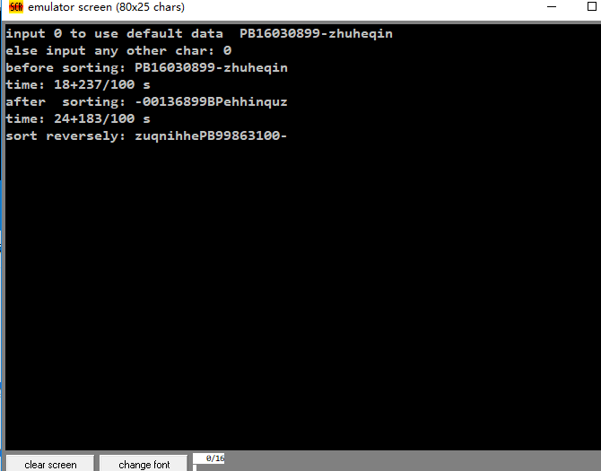

**<span style="float:right">PB16030899-朱河勤 <br>2018-3-16<span>**

# <center>计算机组成原理冒泡排序实验

## 1. 实验要求
用x86汇编语言写一个冒泡排序程序
## 2. 实验过程
* 学习汇编语言
* 学习emu8086的使用
* 看演示文件
* 写代码
* 逐步完善

## 3. 实验要点
### 3.1. 换行

为了便于输出美观,我写了一个输出换行的procedure,用到了interrupt  10h (ah=2),  interrupt 10h (ah=3)
### 3.2. reverse 参数
 为了增强bubbuleSort的功能,我多传入一个参数`reverse`,if reverse is 0:  sort from small to big;else : sort from big to small,. 实现的方法是将比较大小后的结果再与neg reverse 做xor, 这样得到的结果决定是否要进行相邻两元素的交换.
### 3.3. sub使用误区
注意sub只有两个参数, 如果写三个sub a,b,c 以为是 a=b-c ,结果编译器把c忽略, 得到a=b, 而且没有任何通知, 伤心😭 辣鸡编译器
### 3.4. 程序效率
为提高运行速度,多用reg, 少mem access
### 3.5. 计时
使用int 21h (ah=2ch), 然后读取cx,dx中的数据, 注意mul,div的使用,

## 4. 实验结果



## 5. [附]代码
```assembles
;name: bubbleSort
;author: mbinary
;time: 2018-3-16    
;function: just for fun~  :D  
;exprience: 1. sub takes two args
;           2. use less mem access and more regs (to make the programm faster)

include 'emu8086.inc'

org 100h  

lea si,msg      
      
print "input 0 to use default data  PB16030899-zhuheqin"
call newline
print "else input any other char: "
mov  ah,1
int 21h  
call newline

cmp al,48
je   begin

print "input char one by one, input $ to end"
call newline

input:
int 21h
putc ' '
cmp al,36
je stop
mov [si],al,
inc si
jmp input

stop:
mov [si],0
call newline


begin:
lea si,msg  
print "before sorting: " 
call print_string 
call newline   
 
call marktime
bubbleSort si,0 
call printtime
call newline

print "after  sorting: "    
call print_string  
call newline
    
    
call marktime             
bubbleSort si,1
call printtime
call newline
             
print "sort reversely: "
call print_string
call newline

ret

 
DEFINE_PRINT_STRING  ;  dont forget this!
 
msg db "PB16030899-zhuheqin",50 dup(0)
  
bubbleSort macro  begin,reverse    
    ;sort a null terminated string which is from begin
    ;if reverse is 0:  sort from small to big
    ;else           : sort from big to small   
    local   swap,check , count,turn, finish
    mov bx,begin
    dec bx
  count:   
    inc bx
    cmp [bx], 0
    jne count
    
    mov cx,bx
    mov al,reverse
    neg al    ; good job!(￣、￣)  

  turn: 
    mov bx,begin 
    dec cx
    cmp cx,bx
    je finish  
    
  swap:  
    mov dh,[bx+1]
    mov dl, [bx]
    mov ah,dh   
    ;note that sub takes exactly two args, and if you write 'sub ah,dh,dl'
    ;wrongly take that it reprs  a=b-c,     however
    ;the compiler will ignore dl,   without a notice! shit!!!
    sub ah,dl   
    
    xor ah,al
    jns  check
    
    mov [bx+1], dl
    mov [bx],dh  
    
  check: 
    inc bx 
    cmp bx,cx   
    jl swap
    
    jmp turn 
  finish:      
endm
       
newline proc
    ;row dh   column  dl  bh page number 
    mov stah,ah
    mov stbh,bh
    mov stdh,dh
    mov stdl,dl
    mov bh,0
    mov ah,3
    int 10h
    inc dh 
    mov dl,0  
    mov ah,2 
    int 10h  
    mov ah,stah
    mov bh,stbh
    mov dh,stdh
    mov dl,stdl
    ret
newline endp


marktime proc
    mov stah,ah
    mov stbh,bh
    mov stcl,cl
    mov stch,ch
    mov stdl,dl
    mov ah,2ch
    int 21h
    mov stm,cl
    mov sts,dh
    mov stss,dl
    mov sth,ch 
    mov ah,stah
    mov cl,stcl
    mov ch,stch
    mov dh,stdh
    mov dl,stdl
    ret   
marktime endp

printtime proc 
    mov stah,ah
    mov stbh,bh
    mov stcl,cl
    mov stch,ch
    mov stdl,dl
    

    mov ah,2ch
    int 21h  
    sub ch,sth 
    sub cl,stm
    sub dh,sts 
    sub dl,stss
    
    mov ax,60
    mul ch 
    add al,cl
    mov cx,ax
    mov ax,60
    mul cl
    add al,dh 
    print  "time: "
    call print_num_uns
    putc '+'
    mov ax,0
    mov al,dl 
    call print_num_uns
    print "/100 s"
     
    mov ah,stah
    mov cl,stcl
    mov ch,stch
    mov dh,stdh
    mov dl,stdl   
    ret
printtime endp


stah db  0
stbh db  0
stcl db  0
stch db  0
stdl db  0
stdh db  0
stm  db  0
sts  db  0 
stss db  0   
sth db  0

DEFINE_PRINT_NUM
DEFINE_PRINT_NUM_UNS

end
```
