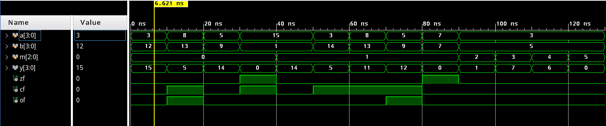
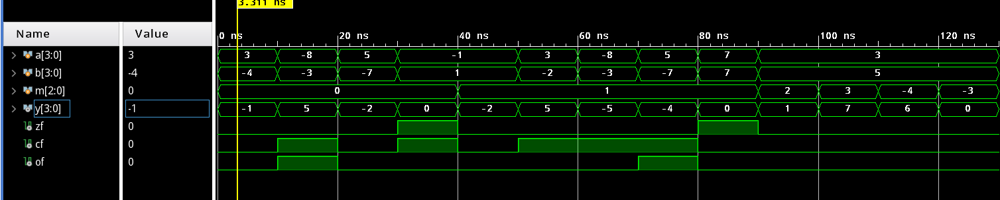
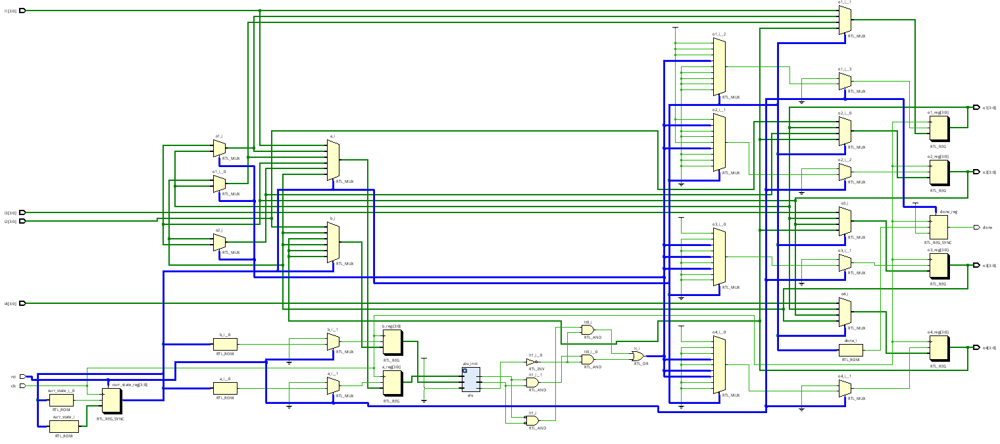

## Lab1 ALU&Sort Report

古宜民 PB17000002

2020.4.26

### ALU设计与仿真

算数逻辑单元需要对于不同的操作方式m对输入的a, b进行不同的运算，并判断计算结果设置状态变量（cf, zf, of）。使用纯组合逻辑即可。对于合法的运算，需要判断结果是否为0，设置zf；对于加减，判断是否溢出（即最高位符号位是否变化异常）以及是否进位（即两个N位数加减得到N+1位数，第N+1位是否变为1）。

代码：

```verilog
module alu
    #(parameter WIDTH = 32)
    (
        input [2:0]m, // selection
        input [WIDTH-1:0]a, b, // input
        output [WIDTH-1:0]y, // result
        output zf, // zero flag
        output cf, // carry out flag: WIDTH bit
        output of // overflow flag: WIDTH-1 sign bit
    );

    reg [WIDTH-1:0]regy;
    reg regcf;
    reg regof;
    reg regzf;
    assign y = regy;
    assign cf = regcf;
    assign of = regof;
    assign zf = regzf;

    always @ (a, b, m) begin
        case(m)
            3'b000: begin // add
                {regcf, regy} = a + b;
                regof = (!a[WIDTH-1] & !b[WIDTH-1] & regy[WIDTH-1]) |
                 (a[WIDTH-1] & b[WIDTH-1] & !regy[WIDTH-1]);
                regzf = (regy == 0);
            end
            3'b001: begin // sub
                {regcf, regy} = a - b;
                regof = (!a[WIDTH-1] & b[WIDTH-1] & regy[WIDTH-1]) |
                 (a[WIDTH-1] & !b[WIDTH-1] & !regy[WIDTH-1]);
                regzf = (regy == 0);
            end
            3'b010: begin // and
                regy = a & b;
                regzf = (regy == 0);
                regcf = 0;
                regof = 0;
            end
            3'b011: begin // or
                regy = a | b;
                regzf = (regy == 0);
                regcf = 0;
                regof = 0;
            end
            3'b100: begin // xor
                regy = a ^ b;
                regzf = (regy == 0);
                regcf = 0;
                regof = 0;
            end
            default: begin // error
                regy = 0;
                regzf = 0;
                regcf = 0;
                regof = 0;
            end
        endcase
    end
endmodule
```

仿真结果：

radix:unsigned decimal



radix:signed decimal



从左到右的操作为：3+12=15, 8+13-16=5, 5+9=14, 15+1-16=0, 15-1=14, 3-14+16=5, 8-13+16=11, 5-9+16=12, 7-7=0;

可以看到相加进位、相减退位时cf=1。radix调到signed demical，可以看到负数相加得到正数、正数减负数得到负数时of=1。

0011&0101=0001, 0011|0101=0111, 0011&0101=0110, 有错误时全部输出0. 

### sort设计与仿真

使用类似选择排序的算法，每次将两个数送到ALU中判断大小，然后在下一个周期中依据结果判读是否交换两个数。有符号数相减判断大小的条件为：若A>B, 则gt = (~of & ~sf & ~zf) | (of & sf & ~zf)为1.

FSM如图，7个周期完成4个数的排序：


仿真结果：


可见reset结束后7个周期done信号发出，有符号数排序完成。

代码：

```verilog
module sort
    #(parameter N = 4)
    (
        input [N-1:0]i1, i2, i3, i4,
        input clk, rst,
        output reg [N-1:0]o1, o2, o3, o4,
        output reg done
    );

    reg [N-1:0]a, b;
    wire [2:0]m = 3'b001; // minus
    wire of;
    wire zf;
    wire [N-1:0]y;
    wire sf;
    assign sf = y[N-1];
    assign gt = (~of & ~sf & ~zf) | (of & sf & ~zf);
    alu #(.WIDTH(N)) alu_inst
    (
        .m(m),
        .a(a),
        .b(b),
        .of(of),
        .zf(zf),
        .y(y)
    );

    reg [3:0]curr_state;
    // reg [3:0]next_state;

    always @ (posedge clk) begin
        if (rst) begin 
            done <= 0;
            curr_state <= 4'b0000;
        end
        // curr_state <= next_state;
        else begin case (curr_state)
            4'b0000: begin
                o1 <= i1;
                o2 <= i2;
                o3 <= i3;
                o4 <= i4;
                a <= i1;
                b <= i2;
                curr_state <= 4'b0001;
            end
            4'b0001: begin
                if (gt) begin
                    o1 <= o2;
                    a <= o2;
                    o2 <= o1;
                end
                else a <= o1;
                b <= o3;
                curr_state <= 4'b0010;
            end
            4'b0010: begin
                if (gt) begin
                    o1 <= o3;
                    a <= o3;
                    o3 <= o1;
                end
                else a <= o1;
                b <= o4;
                curr_state <= 4'b0011;
            end
            4'b0011: begin
                if (gt) begin
                    o1 <= o4;
                    o4 <= o1;
                    // now o1 contains maximum
                end
                a <= o2;
                b <= o3;
                curr_state <= 4'b0100;
            end
            4'b0100: begin
                if (gt) begin
                    o2 <= o3;
                    a <= o3;
                    o3 <= o2;
                end
                else a <= o2;
                b <= o4;
                curr_state <= 4'b0101;
            end
            4'b0101: begin
                if (gt) begin
                    o2 <= o4;
                    o4 <= o2;
                    // now o2 contains second-max
                end
                a <= o3;
                b <= o4;
                curr_state <= 4'b0110;
            end
            4'b0110: begin
                if (gt) begin
                    o3 <= o4;
                    o4 <= o3;
                    // in order now
                end
                done <= 1;
                curr_state <= 4'b0111;
            end
            4'b0111: begin
                curr_state <= 4'b0111;
            end
        endcase
        end
    end
endmodule
```

查看生产的RTL电路图，可以看到多个MUX构成输入线、ALU、输出寄存器间的数据通路。控制部分为状态机的状态、reset信号、ALU输出的信号处理后得到的大小关系，如图中3组蓝色线，控制了所有的MUX。



### 总结

本次实验成功用组合逻辑实现了ALU，用时序逻辑实现了四个数排序。