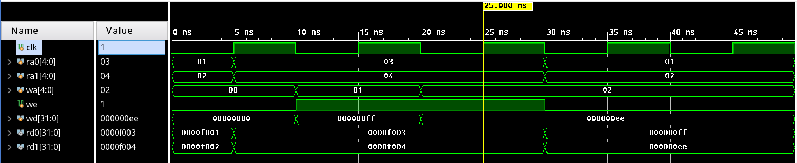
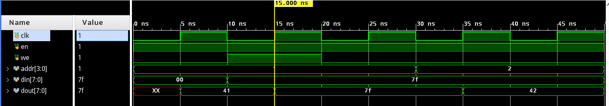
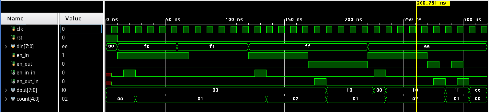

## Lab2 Regfile&RAM&FIFO

古宜民 PB17000002

2020.5.3

### Register File

通过组合逻辑实现两个异步读取，时序逻辑实现一个同步写入。使用 `reg []regfile[]` 实现“二维数组“寄存器。

代码：

```verilog
module register_file
    #(parameter WIDTH = 32)
    (
        input clk,
        input [4:0]ra0,
        input [4:0]ra1,
        input [4:0]wa,
        input we,
        input [WIDTH-1:0]wd,
        output reg [WIDTH-1:0]rd0,
        output reg [WIDTH-1:0]rd1
    );

    reg [WIDTH-1:0]regfile[31:0];
    initial $readmemh("/home/petergu/MyHome/COD/lab2/regfile.dat", regfile);

    always @ (*) begin
        if (ra0 == 5'b0) rd0 = 0;
        else rd0 = regfile[ra0];
        if (ra1 == 5'b0) rd1 = 0;
        else rd1 = regfile[ra1];
    end

    always @ (posedge clk) begin
        if (we) begin
            if (wa != 5'b0) begin
                regfile[wa] <= wd;
            end
        end
    end

endmodule
```

仿真：

```verilog
module regfile_simu();
    reg clk;
    reg [4:0]ra0, ra1;
    reg [4:0]wa;
    reg we;
    reg [31:0]wd;
    wire [31:0]rd0, rd1;

    register_file register_file_inst
    (
        .clk(clk),
        .ra0(ra0),
        .ra1(ra1),
        .wa(wa),
        .we(we),
        .wd(wd),
        .rd0(rd0),
        .rd1(rd1)
    );

    initial begin
        clk = 0;
        forever #5 clk = ~clk;
    end

    initial begin
        ra0 = 1;
        ra1 = 2;
        wa = 0;
        we = 0;
        wd = 0;

        #5
        ra0 = 3;
        ra1 = 4;

        #5
        we = 1;
        wa = 1;
        wd = 32'hff;

        #10
        wa = 2;
        wd = 32'hee;

        #10
        we = 0;
        ra0 = 1;
        ra1 = 2;

        #20
        $finish;
    end
endmodule
```

仿真结果：



寄存器堆初始值为f001,f002,....，在第2，3个周期中对1，2地址写入00ff和00ee，之后异步同时读取1，2地址处的值，可见值已经变为00ff和00ee了。

### RAM 8x16

8x16大小的RAM地址线4位，数据线8位。同步读写，用readmemb初始化。

```verilog
module ram_16x8
    (
        input clk,
        input en, we,
        input [3:0]addr, // depth: 16
        input [7:0]din, // data width: 8
        output [7:0]dout
    );

    reg [3:0]addr_reg;
    reg [7:0]mem[15:0];

    initial $readmemb("/home/petergu/MyHome/COD/lab2/mem.dat", mem);

    assign dout = mem[addr_reg];

    always @ (posedge clk) begin
        if (en) begin
            addr_reg <= addr;
            if (we) begin
                mem[addr] <= din;
            end
        end
    end
endmodule

```

仿真：

```verilog
module mem_simu();
    reg clk;
    reg en, we;
    reg [3:0]addr;
    reg [7:0]din;
    wire [7:0]dout;

    ram_16x8 ram_16x8_inst
    (
        .clk(clk),
        .en(en),
        .we(we),
        .addr(addr),
        .din(din),
        .dout(dout)
    );

    initial begin
        clk = 0;
        forever #5 clk = ~clk;
    end

    initial begin
        en = 1;
        we = 0;
        addr = 4'b1;
        din = 8'b0;

        #10
        we = 1;
        din = 8'b01111111;
        #10
        we = 0;
        #10
        addr = 4'b10;

        #20
        $finish;
    end
endmodule
```

仿真结果：



地址1，2处的初始化值为41，42. 第一个周期读地址1处的值，第二个周期向1处写入值7f，第三个周期读，可见地址1处值变为了7f. 第四个周期读地址2处的值，为42. 

### FIFO

先进先出队列，en_in和en_out经过取边沿后控制进出队列。使用head和tailp1(tail+1)头尾指针控制循环队列，如果入队且队列不满，就向tailp1处写入入队值，然后tailp1加1. 如果出队，读出head处的值，head加一。使用一块分布式RAM作为存储。

使用了结构化描述方法，为此实现了mux21选择器和edgefetcher取边沿电路。

```verilog
module mux21
    #(parameter N = 8)
    (
        input [N-1:0]a,
        input [N-1:0]b,
        input sel,
        output reg [N-1:0]o
    );
    always @ (*) begin
        if (sel == 0) o = a;
        else o = b;
    end
endmodule

module edgefetcher
    (
        input clk, rst,
        input y,
        output p
    );
    reg [1:0]state, next_state; 
    assign p = (state == 1);
    always @ (posedge clk) begin
        if (rst) state <= 0;
        else state <= next_state;
    end
    always @ (*) begin
        next_state = state;
        case (state)
            0: if (y) next_state = 1;
            1: if (y) next_state = 2; else next_state = 0;
            2: if (y) next_state = 2; else next_state = 0;
            default: next_state = 0;
        endcase
    end
endmodule

module fifo
    (
        input clk, rst,
        input [7:0]din,
        input en_in, 
        input en_out,
        output en_in_in,
        output en_out_in,
        output [7:0]dout,
        output reg [4:0]count = 0
    );

    reg [3:0]head = 4'b0;
    reg [3:0]tailp1 = 4'b0;
    wire [3:0]head_wire;
    wire [3:0]tailp1_wire;
    wire [4:0]count_wire;
    wire [3:0]head_wire_rst;
    wire [3:0]tailp1_wire_rst;
    wire [4:0]count_wire_rst;

    wire we;
    wire [3:0]a;
    dist_mem_gen_0 dist_mem_gen_0_inst (
        .clk(clk),
        .we(we),
        .a(a),
        .d(din),
        .spo(dout)
    );

    //wire en_in_in, en_out_in;
    edgefetcher edgefetcher_inst_1 (
        .clk(clk),
        .rst(rst),
        .y(en_in),
        .p(en_in_in)
    );
    edgefetcher edgefetcher_inst_2 (
        .clk(clk),
        .rst(rst),
        .y(en_out),
        .p(en_out_in)
    );

    wire en_in_real = en_in_in & (count != 5'b11111);
    wire en_out_real = en_out_in & (count != 5'b0);

    // we port selection
    mux21 #(1) mux21_1 (1'b0, 1'b1, en_in_real, we);
    // addr: part it at head if no enqueue
    mux21 #(4) mux21_2 (head, tailp1, en_in_real, a);
    // tail++,count++ if enqueue, head++,count-- if dequeue
    mux21 #(4) mux21_3 (tailp1, tailp1 + 1, en_in_real, tailp1_wire);
    mux21 #(4) mux21_3_rst (tailp1_wire, 4'b1, rst, tailp1_wire_rst);
    mux21 #(4) mux21_4 (head, head + 1, en_out_real, head_wire);
    mux21 #(4) mux21_4_rst (head_wire, 4'b0, rst, head_wire_rst);
    wire [4:0]countpm;
    mux21 #(5) mux21_5 (count + 1, count - 1, en_out_real, countpm);
    mux21 #(5) mux21_6 (count, countpm, en_in_real | en_out_real, count_wire);
    mux21 #(5) mux21_6_rst (count_wire, 5'b0, rst, count_wire_rst);
    always @ (posedge clk) begin
        tailp1 <= tailp1_wire_rst;
        head <= head_wire_rst;
        count <= count_wire_rst;
    end

endmodule
```

仿真：

```verilog
module fifo_simu();
    reg clk, rst;
    reg [7:0]din;
    reg en_in;
    reg en_out;
    wire en_in_in;
    wire en_out_in;
    wire [7:0]dout;
    wire [4:0]count;

    fifo fifo_inst
    (
        .clk(clk),
        .rst(rst),
        .din(din),
        .en_in(en_in),
        .en_out(en_out),
        .en_in_in(en_in_in),
        .en_out_in(en_out_in),
        .dout(dout),
        .count(count)
    );

    initial begin
        clk = 0;
        forever #5 clk = ~clk;
    end

    initial begin
        rst = 1;
        en_in = 0;
        en_out = 0;
        din = 0;

        #10
        rst = 0;
        en_in = 1;
        din = 8'hf0;

	#40
        #10
        din = 8'hf1;

        #10
        en_in = 0;

	#40
        #10
        en_in = 1;
        din = 8'hff;

	#40
        #10
        en_in = 0;
        en_out = 1;

	#40
        #10
        en_in = 1;
        en_out = 0;
        din = 8'hee;

	#40
        #10
        en_in = 0;
        en_out = 1;

        #10
	en_out = 0;

        #10
	en_out = 1;

        #10
        en_out = 0;

        #20
        $finish;
    end
endmodule
```

仿真结果：



如图，从左到右依次入队f0、ff、出队（f0）、入队ee、出队（ff）、出队（ee）。

其中en_in_in和en_out_in为取边沿之后的输入信号，count为队列中元素个数。

### 总结

本次实验实现了Regfile、RAM和FIFO，内容主要是对寄存器和内存的读写操作。

