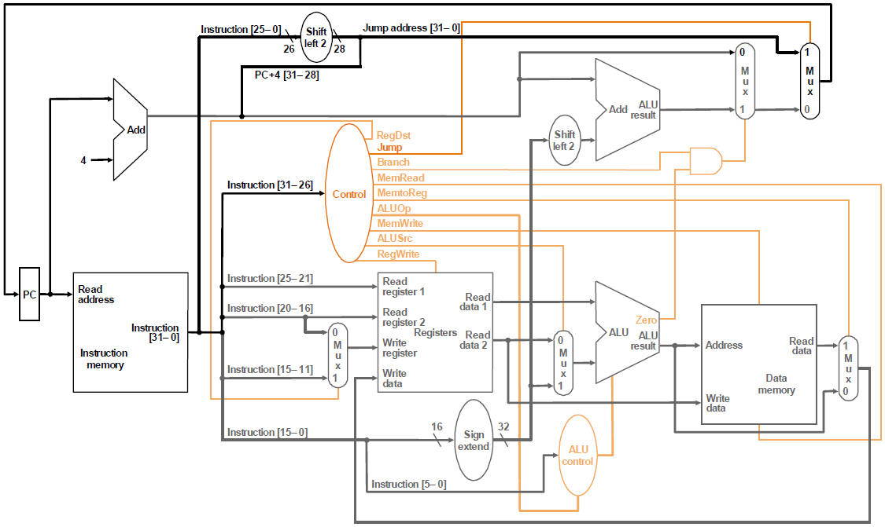
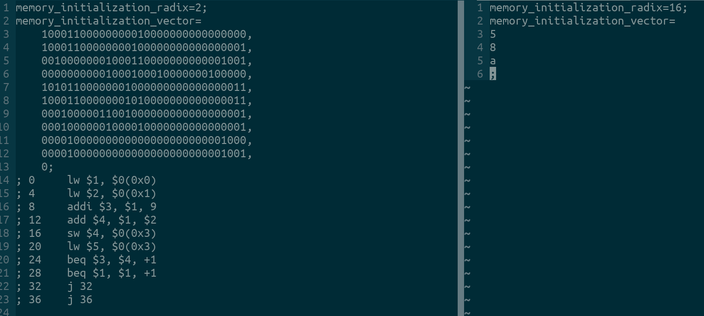
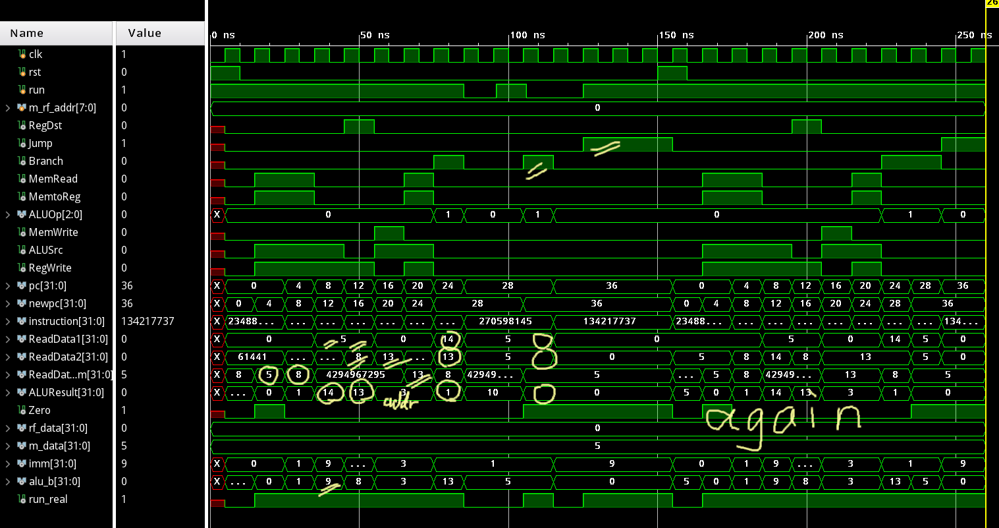
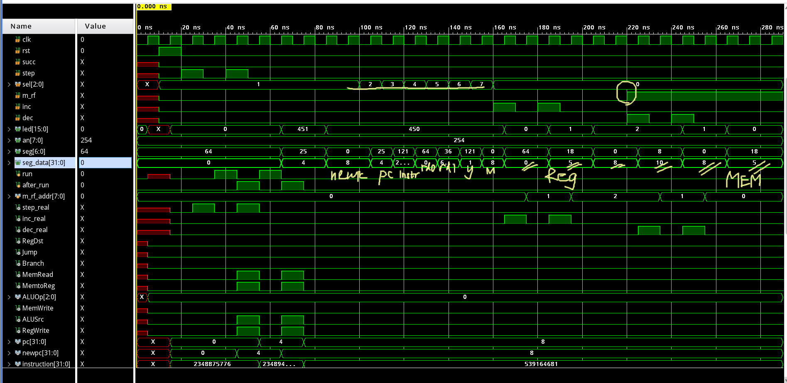

## Lab3 单周期CPU

古宜民 PB17000002

2020.5.22

### CPU

数据通路和状态设计

数据通路为文档上的逻辑图：



其中指令寄存器处，接入地址为`pc[9:2]`。

如果在运行状态，则每个周期时钟上升沿`pc <= newpc`，更新PC的值。在下一个时钟上升沿会写入前一个周期对寄存器堆和数据内存的写入操作。这也是唯一的时序部分，其他的控制器、MUX和读取数据均只需要组合逻辑：只需要对指令的类型和寄存器/立即数/内存地址解码并相应改变各个数据线上的值即可。

主要代码：

WriteRegister，ALU，WriteData三个MUX：

```verilog
    always @(*) begin
        if (RegDst == 1'b1) WriteRegister = instruction[15:11];
        else WriteRegister = instruction[20:16];

        if (ALUSrc == 1'b1) alu_b = imm;
        else alu_b = ReadData2;

        if (MemtoReg == 1'b1) WriteData_alu = ReadData_ram;
        else WriteData_alu = ALUResult;
    end
```

控制器Controller的信号：

```verilog
    always @ (*) begin
        if (run) begin
            RegDst = 0;
            Jump = 0;
            Branch = 0;
            MemRead = 0;
            MemtoReg = 0;
            MemWrite = 0;
            ALUSrc = 0;
            RegWrite = 0;
            ALUOp = 3'b000; // default: plus
            case (instruction[31:26])
                6'b000000:
                    case (instruction[5:0])
                        // add--- --rs- --rt- --rd- shamt funct-
                        6'b100000: begin RegDst = 1; RegWrite = 1; end
                        default: ;
                    endcase
                // addi-- --rs- --rt- ----immediate---
                6'b001000: begin ALUSrc = 1; RegWrite = 1; end
                // lw---- --rs- --rt- ----addr--------
                6'b100011: begin ALUSrc = 1; RegWrite = 1; MemRead = 1; MemtoReg = 1; end
                // sw---- --rs- --rt- ----addr--------
                6'b101011: begin ALUSrc = 1; MemWrite = 1; end
                // beq-- --rs- --rt- ----addr--------
                6'b000100: begin Branch = 1; ALUOp = 3'b001; end
                // j---- ----addr------------------
                6'b000010: begin Jump = 1; end
                default: ;
            endcase

            if (Jump == 1'b0) begin
                if ((Branch & Zero) == 1'b0) newpc = pc + 4;
                else newpc = pc + 4 + (imm << 2);
            end
            else newpc = {4'b0000, instruction[25:0], 2'b00};
        end
        else begin
            RegDst = 0;
            Jump = 0;
            Branch = 0;
            MemRead = 0;
            MemtoReg = 0;
            MemWrite = 0;
            ALUSrc = 0;
            RegWrite = 0;
            ALUOp = 3'b000;
            newpc = pc;
        end
    end
```

时序控制：

```verilog
    always @ (posedge clk) begin
        if (rst) begin
            pc <= 32'b0;
            run <= 0;
        end
        else begin
            pc <= newpc;
            run <= run_in;
        end
    end
```

这里为了避免不必要的顺序，三个MUX和Controller写在了两段中。而控制PC的MUX由newpc处的if判断行为级实现了（其实所有代码都是行为级的）。为了和DBU合作，CPU中加入了run信号，run=1时才会继续运行。

仿真结果

ROM和RAM的初始值如下，使用自编的测试代码，涵盖了全部6条指令。正确运行的结果应为在24 beq处，\$3==5+9=13, \$4==5+8=13, 二者不下相等，不跳转，而28 beq跳转，到36 j 36，开始死循环。 





仿真结果可见（标注的部分），依次进行了读取5、读取8、5+9=14、5+8=13、存13、取13、14-13=1不跳转、5-5=0跳转、jump跳转。在中间run暂停以及reset后PC再次置为0后都能得到正确的结果。

### DBU

DBU的目的是控制CPU的运行并从中获得调试数据。而如果在CPU暂停的时候CPU中的控制信号不归零，即使控制了PC不变，也可能出现意外写入，所以控制信号在暂停时必须归0. 从而如果DBU要保持CPU中的信号并显示在数码管和LED上，必须由内部寄存器保存数据。同时手动输入DBU的信号需要进行取边沿。这都导致了从CPU信号出现到显示在人类可阅读设备中需要几个周期的延迟。

仿真结果：



图为CPU运行2个周期后查看各个信号的值，演示了读取信号和寄存器、内存地址的功能。

主要代码：

```verilog
        else begin
            if (after_run) {RegDst_save, Jump_save, Branch_save, MemRead_save, MemtoReg_save, ALUOp_save, MemWrite_save, ALUSrc_save, RegWrite_save, pc_save, newpc_save, instruction_save, ReadData1_save, ReadData2_save, ReadData_ram_save, ALUResult_save, Zero_save} <= {RegDst, Jump, Branch, MemRead, MemtoReg, ALUOp, MemWrite, ALUSrc, RegWrite, pc, newpc, instruction, ReadData1, ReadData2, ReadData_ram, ALUResult, Zero};

            if (inc_real) m_rf_addr <= m_rf_addr + 1;
            else if (dec_real) m_rf_addr <= m_rf_addr - 1;

            run <= step_real;
            after_run <= run;
            if (sel == 3'b0)
                led <= {8'b0, m_rf_addr};
            else
                led <= {4'b0, Jump_save, Branch_save, RegDst_save, RegWrite_save, MemRead_save, MemtoReg_save, MemWrite_save, ALUOp_save, ALUSrc_save, Zero_save};
            case (sel)
                0: begin
                    if (m_rf == 1) seg_data <= m_data; else seg_data = rf_data;
                end
                1: seg_data <= newpc_save;
                2: seg_data <= pc_save;
                3: seg_data <= instruction_save;
                4: seg_data <= ReadData1_save;
                5: seg_data <= ReadData2_save;
                6: seg_data <= ALUResult_save;
                7: seg_data <= ReadData_ram_save;
                default: seg_data <= 32'b0;
            endcase
        end
```

### 总结

本次实验实现了单周期CPU，其中其实DBU的实现更加复杂和繁琐一些。刚开始不太熟悉整体运行的逻辑，熟悉了设计思路后编码还是比较快的。

完整代码在http://home.ustc.edu.cn/~guyimin/Legacy/lab3.tar.gz

sha1:3665575e3f846fdbfa027464c854a3cfbecd393c