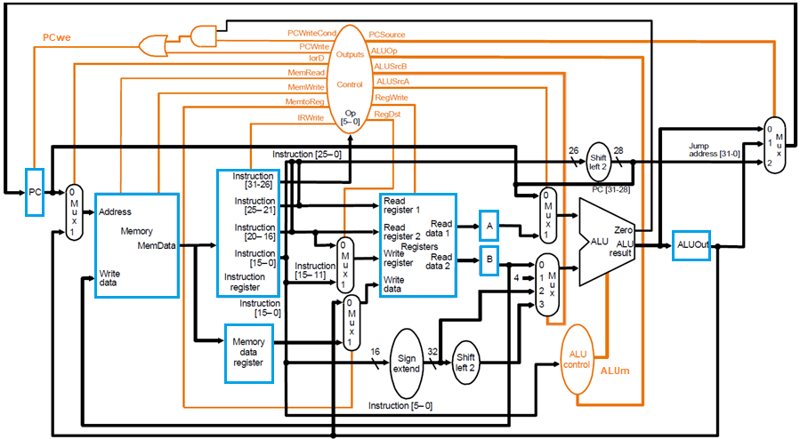
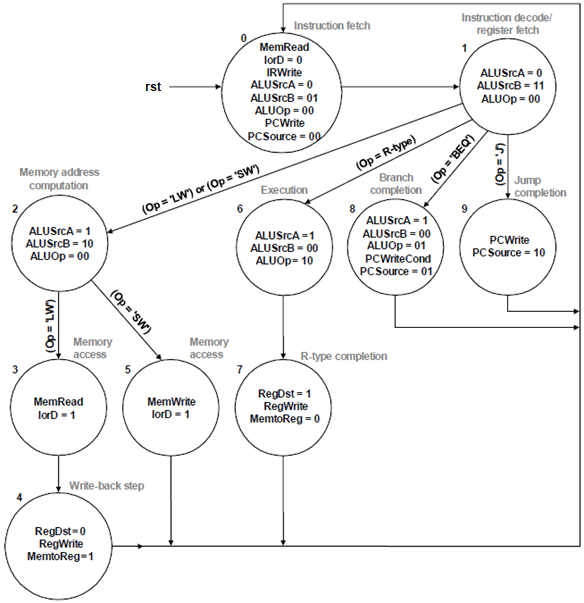
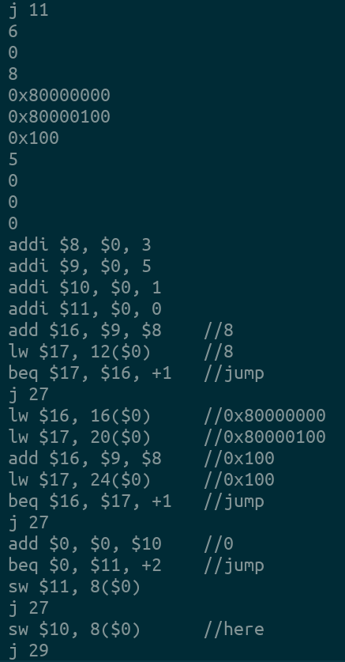
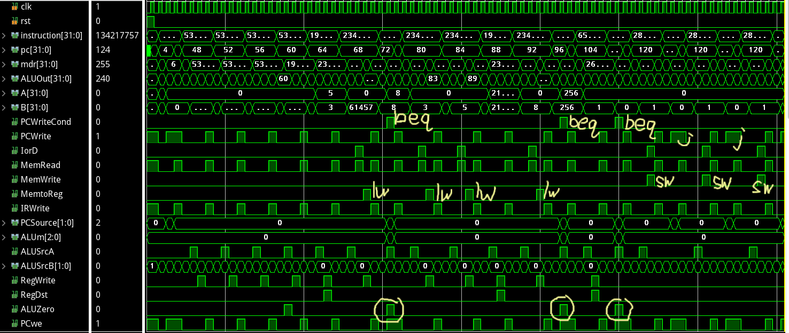
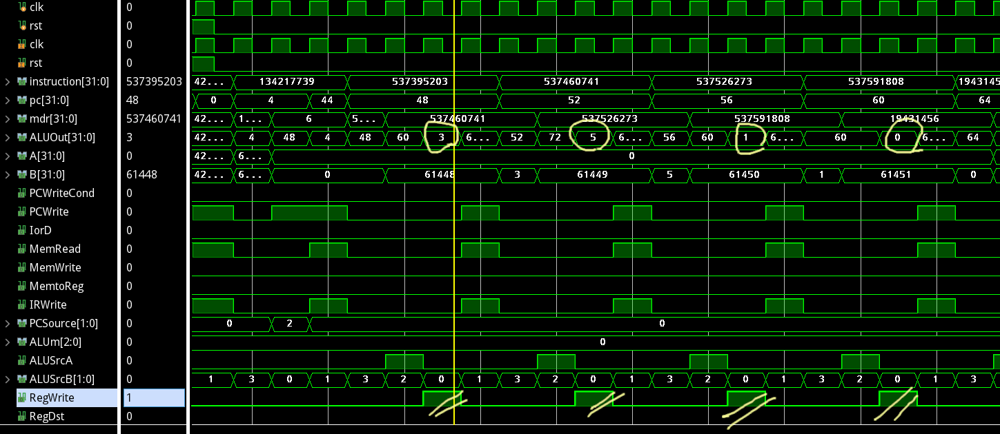
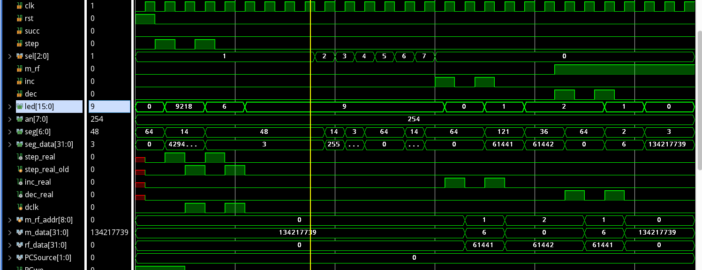

## Lab4 多周期CPU

古宜民 PB17000002

2020.6.5

### CPU

数据通路和状态设计

数据通路为文档上的逻辑图：



其中指令寄存器处，接入地址为`pc[10:2]`。

时序部分，每个周期需要更新寄存器A，B，MDR，ALUOut，以及PC和Instruction的值。

```verilog
    always @ (posedge clk) begin
        if (rst) begin
            pc <= 32'b0;
        end
        else begin
            A <= ReadData1;
            B <= ReadData2;
            ALUOut <= ALUResult;
            mdr <= MemData;
            if (PCwe) pc <= newpc;
            if (IRWrite) instruction <= MemData;
        end
    end
endmodule
```

数据通路由控制信号通过组合逻辑控制：

```verilog
    always @ (*) begin
        if (IorD) mem_addr = ALUOut; else mem_addr = pc;
        if (ALUSrcA) ALUIn1 = A; else ALUIn1 = pc;
        if (RegDst) WriteRegister = instruction[15:11]; 
            else WriteRegister = instruction[20:16];
        if (MemtoReg) WriteData = mdr;
            else WriteData = ALUOut;
        case (ALUSrcB)
            0: ALUIn2 = B;
            1: ALUIn2 = 4;
            2: ALUIn2 = imm;
            3: ALUIn2 = imm << 2;
        endcase
        case (PCSource)
            0: newpc = ALUResult;
            1: newpc = ALUOut;
            2: newpc = {pc[31:28], instruction[25:0], 2'b0};
            default: newpc = 32'hffffffff;
        endcase
    end
```

控制信号由Control状态机生成，如PPT中给出的状态机：

为了实现ADDI指令，需要加入一个状态Addi completion，并增加Memory address computation->Addi completion->Instruction fetch的跳转。



```verilog
    // control unit FSM
    // input: instruction[31:26], output: control signals
    wire [5:0]Op = instruction[31:26];
    localparam IF = 0;
    localparam ID_RF = 1;
    localparam MEM_ADDR_CALC = 2;
    localparam MEM_ACCESS_LW = 3;
    localparam WB = 4; 
    localparam MEM_ACCESS_SW = 5;
    localparam R_EX = 6;
    localparam R_END = 7;
    localparam BEQ_END = 8;
    localparam J_END = 9;
    localparam ADDI_END = 10;
    localparam BAD = 11;
    localparam OP_ADD = 6'b000000;
    localparam OP_ADDI = 6'b001000;
    localparam OP_LW = 6'b100011;
    localparam OP_SW = 6'b101011;
    localparam OP_BEQ = 6'b000100;
    localparam OP_J = 6'b000010;
    //reg [3:0]phase = IF;
    always @ (*) begin
        PCWriteCond = 0;
        PCWrite = 0;
        IorD = 0;
        MemRead = 0;
        MemWrite = 0;
        MemtoReg = 0;
        IRWrite = 0;
        PCSource = 2'b00;
        ALUm = 3'b000;
        ALUSrcA = 0;
        ALUSrcB = 0;
        RegWrite = 0;
        RegDst = 0;
        case (phase)
            IF: begin MemRead = 1; ALUSrcB = 2'b01; IRWrite = 1; PCWrite = 1; end
            ID_RF: ALUSrcB = 2'b11;
            MEM_ADDR_CALC: begin ALUSrcA = 1; ALUSrcB = 2'b10; end
            MEM_ACCESS_LW: begin MemRead = 1; IorD = 1; end
            ADDI_END: begin RegWrite = 1; end
            WB: begin RegWrite = 1; MemtoReg = 1; end
            MEM_ACCESS_SW: begin IorD = 1; MemWrite = 1; end
            R_EX: ALUSrcA = 1;
            R_END: begin RegDst = 1; RegWrite = 1; end
            BEQ_END: begin ALUSrcA = 1; ALUm = 3'b001; PCWriteCond = 1; PCSource = 2'b01; end
            J_END: begin PCWrite = 1; PCSource = 2'b10; end
            default: ;
        endcase
    end
    always @ (posedge clk or posedge rst) begin
        if (rst) begin
            phase <= IF;
        end
        else begin
            case(phase)
                IF: phase <= ID_RF;
                ID_RF: 
                    case(Op)
                        OP_LW: phase <= MEM_ADDR_CALC;
                        OP_SW: phase <= MEM_ADDR_CALC;
                        OP_ADDI: phase <= MEM_ADDR_CALC;
                        OP_ADD: phase <= R_EX;
                        OP_BEQ: phase <= BEQ_END;
                        OP_J: phase <= J_END;
                        default: phase <= BAD;
                    endcase
                MEM_ADDR_CALC:
                    case (Op)
                        OP_LW: phase <= MEM_ACCESS_LW;
                        OP_SW: phase <= MEM_ACCESS_SW;
                        OP_ADDI: phase <= ADDI_END;
                        default: phase <= BAD;
                    endcase
                MEM_ACCESS_LW: phase <= WB;
                WB: phase <= IF;
                MEM_ACCESS_SW: phase <= IF;
                ADDI_END: phase <= IF;
                R_EX: phase <= R_END;
                R_END: phase <= IF;
                BEQ_END: phase <= IF;
                J_END: phase <= IF;
                default: phase <= BAD;
            endcase
        end
    end
```

仿真结果：

使用助教提供的程序：





全部波形如图，可见每一条指令的执行过程。其中标注出了一部分指令的特征信号。



仿真开始的几条指令，从中可见四个addi均正确得出了值（3，5，1，0）并RegWrite写回了目标寄存器。

### DBU

本实验的DBU通过控制发送给CPU的时钟信号实现调试。其他内容与lab3的DBU几乎相同。

仿真结果：


图为CPU运行2个周期后查看各个信号的值，演示了读取信号和寄存器、内存地址的功能。

主要代码：

```verilog
    always @ (posedge clk) begin
        if (rst) begin
            m_rf_addr <= 0;
            dclk <= 0;
            led <= 16'b0;
            step_real_old <= 0;
        end
        else begin
            if (succ == 1) begin dclk <= !dclk; end
            else begin
                if (step_real) dclk <= !dclk;
                else if (step_real_old) dclk <= !dclk;
            end

            step_real_old <= step_real;

            if (inc_real) m_rf_addr <= m_rf_addr + 1;
            else if (dec_real) m_rf_addr <= m_rf_addr - 1;

            if (sel == 3'b0)
                led <= {7'b0, m_rf_addr};
            else
                led <= {PCSource, PCwe, IorD, MemWrite, IRWrite, RegDst, MemtoReg, RegWrite, ALUm, ALUSrcA, ALUSrcB, ALUZero};
            case (sel)
                0: begin 
                    if (m_rf == 1) seg_data <= m_data; else seg_data <= rf_data;
                end
                1: seg_data <= pc;
                2: seg_data <= instruction;
                3: seg_data <= mdr;
                4: seg_data <= A;
                5: seg_data <= B;
                6: seg_data <= ALUOut;
                default: seg_data <= 32'b0;
            endcase
        end
    end
```

### 总结

多周期CPU相比单周期稍微复杂了一些，因为仿真时间较长并且信号较多略有“混乱”，比如寄存器堆和内存读结果等在一些周期未被使用，但是仍有变化的输出，这增加了调试的难度。

完整代码在http://home.ustc.edu.cn/~guyimin/Legacy/lab4.tar.gz

sha1:f44bedc8196e0709ce59bfe68047f2e395d46f08