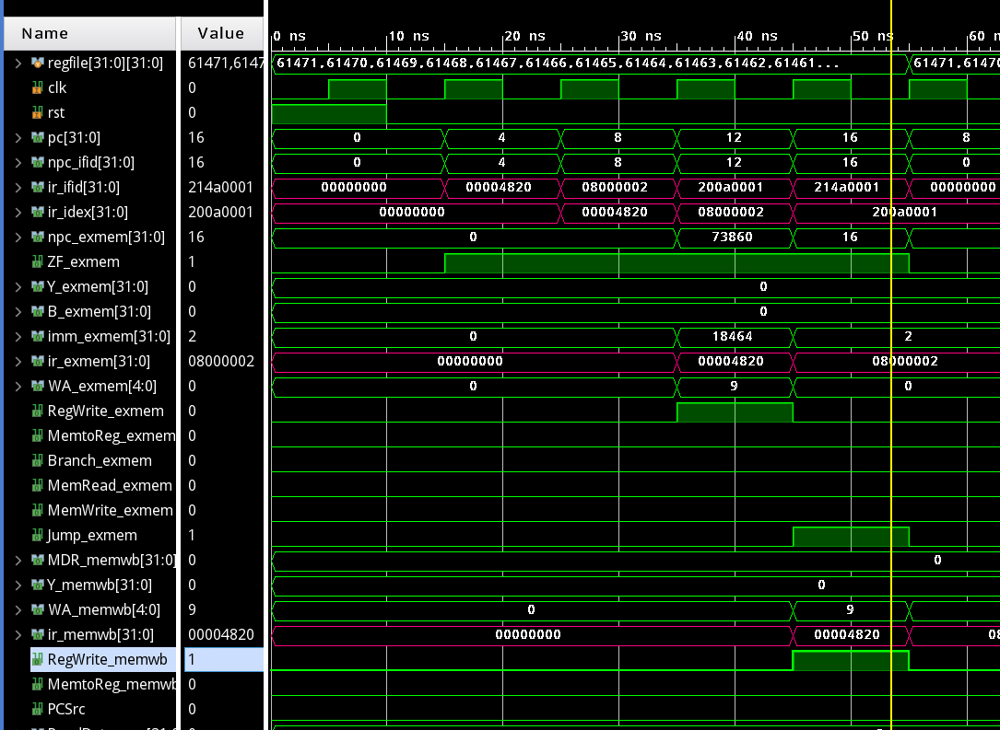
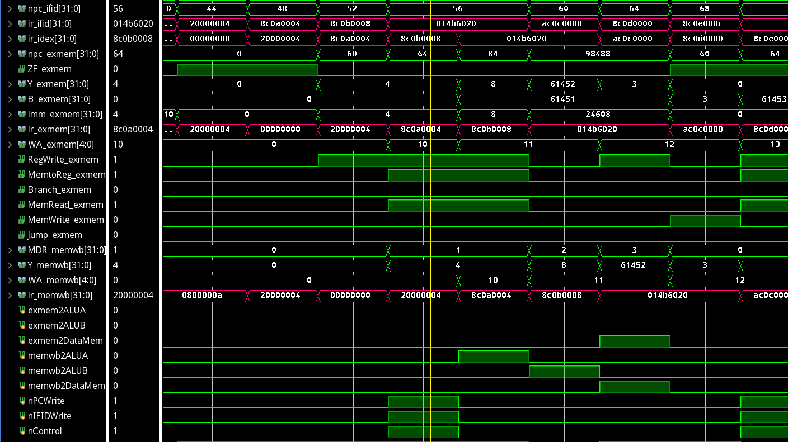
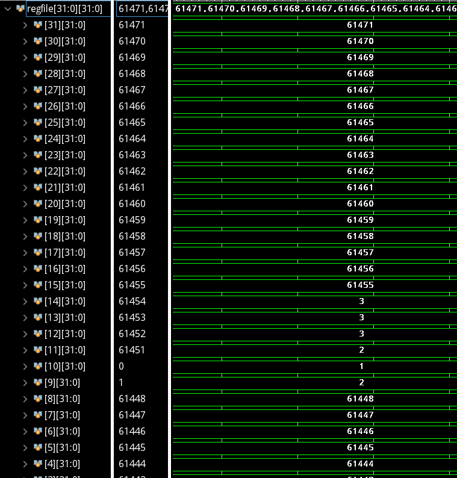

## Lab5 流水线CPU

古宜民 PB17000002

2020.6.25

### CPU

**寄存器堆**

为了支持充足的转发寄存器堆必须支持一个周期内先写后读，这里使用了寄存器堆内的转发实现这一功能，而真正写入依旧等到下一个时钟上升沿。

**数据通路**

数据通路基于文档上的逻辑图：


除了给出的内容外，还要加上ADDI，JUMP指令的数据通路。BEQ和JUMP指令未进行提前，仍然在MEM段完成。

另外，除了处理Control Unit给出的控制信号之外，还要处理转发和冒险单元给出的信号，加入从后到前数据的通路和流水线寄存器清空插入气泡的功能。

时序部分，每个周期需要更新各个段寄存器的值。无转发时新的值来自上一段的计算结果，而发生转发（信号exmem2ALUA，exmem2ALUB，memwb2ALUA，memwb2ALUB，exmem2DataMem，memwb2DataMem，来自转发单元）时新的值可能来自本段或其之后的段。有气泡时（信号nPCWrite，nIFIDWrite，来自冒险检测单元）PC将不会更新，重新取一次当前指令。发生跳转时清零流水线（Flush，来自控制单元），将过去计算完成的结果清零。

```verilog
    always @ (*) begin
        // with forwarding
        if (exmem2ALUA) ALUa = Y_exmem;
        else if (memwb2ALUA) ALUa = WriteData;
        else ALUa = A_idex;
    end
    always @ (*) begin
        // with forwarding
        if (exmem2ALUB) ALUb = Y_exmem;
        else if (memwb2ALUB) ALUb = WriteData;
        else if (ALUSrc_idex) ALUb = imm_idex;
        else ALUb = B_idex;
    end
    always @ (*) begin
        if (MemtoReg_memwb) WriteData = MDR_memwb;
        else WriteData = Y_memwb;
    end
    always @ (posedge clk) begin
        if (rst) begin
			...
        end
        else begin
            // pc
            // with interlock
            if (nPCWrite == 0) begin
                if (Jump_exmem) pc <= {4'b0000, ir_exmem[25:0], 2'b00};
                else if (PCSrc) pc <= npc_exmem;
                else pc <= pc + 4;
            end

            // data -- ifid
            // with interlock
            if (Flush) begin
                npc_ifid <= 0;
                ir_ifid <= 0;
            end
            else if (nIFIDWrite == 0) begin
                npc_ifid <= pc + 4;
                ir_ifid <= instruction;
            end

            // data -- idex
            if (Flush) begin
                npc_idex <= 0;
                A_idex <= 0;
                B_idex <= 0;
                imm_idex <= 0;
                ir_ifid <= 0;
            end
            else begin
                npc_idex <= npc_ifid;
                A_idex <= ReadData1;
                B_idex <= ReadData2;
                imm_idex <= {{16{ir_ifid[15]}}, ir_ifid[15:0]};
                ir_idex <= ir_ifid;
            end

            // data -- exmem
            // this flush is actually unnecessary
            if (Flush) begin
                npc_exmem <= 0;
                ZF_exmem <= 0;
                Y_exmem <= 0;
                imm_idex <= 0;
                WA_exmem <= 0;
                B_exmem <= 0;
            end
            else begin
                npc_exmem <= npc_idex + (imm_idex << 2);
                ZF_exmem <= ALUZero;
                Y_exmem <= ALUy;
                imm_exmem <= imm_idex;
                if (RegDst_idex) WA_exmem <= ir_idex[15:11];
                else WA_exmem <= ir_idex[20:16];
                ir_exmem <= ir_idex;
                // with forwarding
                if (exmem2DataMem) B_exmem <= Y_exmem;
                else B_exmem <= B_idex;
            end

            // data -- memwb
            MDR_memwb <= ReadData_ram;
            Y_memwb <= Y_exmem;
            WA_memwb <= WA_exmem;
            ir_memwb <= ir_exmem;
        end
    end
```

**控制信号**

类似于单周期CPU的控制信号，每条指令对应的控制信号在ID段生成，并需要每个周期传到下一段。如果流水线需要插入气泡则控制单元给出一个周期的全0信号。

代码如下，其中Flush在发生跳转（JUMP或BEQ选中）时生成，nControl来自冒险检测单元。

```verilog
    // control unit
    assign PCSrc = ZF_exmem & Branch_exmem;
    assign Flush = Jump_exmem | PCSrc;
    reg RegWrite;
    reg MemtoReg;
    reg Branch;
    reg MemRead;
    reg MemWrite;
    reg RegDst;
    reg ALUOp;
    reg ALUSrc;
    reg Jump;
    always @ (*) begin
        RegWrite = 0;
        MemtoReg = 0;
        Branch = 0;
        MemRead = 0;
        MemWrite = 0;
        RegDst = 0;
        ALUOp = 3'b0;
        ALUSrc = 0;
        Jump = 0;
        case (ir_ifid[31:26])
            6'b000000:
                case (ir_ifid[5:0])
                    // add--- --rs- --rt- --rd- shamt funct-
                    6'b100000: begin RegDst = 1; RegWrite = 1; end
                    default: ;
                endcase
            // addi-- --rs- --rt- ----immediate---
            6'b001000: begin ALUSrc = 1; RegWrite = 1; end
            // lw---- --rs- --rt- ----addr--------
            6'b100011: begin ALUSrc = 1; RegWrite = 1; MemRead = 1; MemtoReg = 1; end
            // sw---- --rs- --rt- ----addr--------
            6'b101011: begin ALUSrc = 1; MemWrite = 1; end
            // beq-- --rs- --rt- ----addr--------
            6'b000100: begin Branch = 1; ALUOp = 3'b001; end
            // j---- ----addr------------------
            6'b000010: begin Jump = 1; end
            default: ;
        endcase
    end
    always @ (posedge clk) begin
        if (rst) begin
			...
        end
        else begin
            // control -- idex
            if (nControl == 0 & Flush== 0) begin
                RegWrite_idex <= RegWrite;
                MemtoReg_idex <= MemtoReg;
                Branch_idex <= Branch;
                MemRead_idex <= MemRead;
                MemWrite_idex <= MemWrite;
                RegDst_idex <= RegDst;
                ALUOp_idex <= ALUOp;
                ALUSrc_idex <= ALUSrc;
                Jump_idex <= Jump;
            end
            else begin
                RegWrite_idex <= 0;
                MemtoReg_idex <= 0;
                Branch_idex <= 0;
                MemRead_idex <= 0;
                MemWrite_idex <= 0;
                RegDst_idex <= 0;
                ALUOp_idex <= 3'b0;
                ALUSrc_idex <= 0;
                Jump_idex <= 0;
            end

            // control -- exmem
            // this flush is actually unnecessary
            if (Flush) begin
                RegWrite_exmem <= 0;
                MemtoReg_exmem <= 0;
                Branch_exmem <= 0;
                MemRead_exmem <= 0;
                MemWrite_exmem <= 0;
                Jump_exmem <= 0;
            end
            else begin
                RegWrite_exmem <= RegWrite_idex;
                MemtoReg_exmem <= MemtoReg_idex;
                Branch_exmem <= Branch_idex;
                MemRead_exmem <= MemRead_idex;
                MemWrite_exmem <= MemWrite_idex;
                Jump_exmem <= Jump_idex;
            end

            // control -- memwb
            RegWrite_memwb <= RegWrite_exmem;
            MemtoReg_memwb <= MemtoReg_exmem;
        end
    end
```

**转发**

如代码注释，以下各种情况都需要转发：exmem段的ALUOut、memwb段的ALUOut、memwb段的MDR分别转发到ALU的两个输入（ALUInA，ALUInB）以及内存写入的数据（DataMemory，无转发时为B_exmem）

```
        // ADDI + LW
        // ADDI + SW(ex)
        // ADDI + ADDI
        // ADDI + R(A)
        // ADDI + BEQ(A)
        //  exmem(ALUOut) to ALUIn A
        // ADDI + R(B)
        // ADDI + BEQ(B)
        //  exmem(ALUOut) to ALUIn B
        
        // R + LW
        // R + SW(ex)
        // R + ADDI
        // R + R(A)
        // R + BEQ(A)
        //  exmem(ALUOut) to ALUIn A
        // R + R(B)
        // R + BEQ(B)
        //  exmem(ALUOut) to ALUIn B

        // LW + * + LW
        // LW + * + SW(wb)
        // LW + * + ADDI
        // LW + * + R(A)
        // LW + * + BEQ(A)
        // ADDI + * + LW
        // ADDI + * + SW(ex)
        // ADDI + * + ADDI
        // ADDI + * + R(A)
        // ADDI + * + BEQ(A)
        //  memwb(ALUOut or MDR) to ALUIn A
        // LW + * + R(B)
        // LW + * + BEQ(B)
        // ADDI + * + R(B)
        // ADDI + * + BEQ(B)
        //  memwb(ALUOut or MDR) to ALUIn B

        // R + * + LW
        // R + * + SW(ex)
        // R + * + ADDI
        // R + * + R(A)
        // R + * + BEQ(A)
        //  memwb(ALUOut) to ALUIn A
        // R + * + R(B)
        // R + * + BEQ(B)
        //  memwb(ALUOut) to ALUIn B

        // R + SW(wb)
        // exmem(ALUOut) to DataMemory(B_exmem)
        // R + * + SW(wb)
        // memwb(ALUOut) to DataMemory(B_exmem)
        // LW + SW(wb)
        // memwb(MDR) to DataMemory(B_exmem)
```

而转发的条件是ID/EX段的指令（接受转发）与EX/MEM或MEM/WB（来源）指令的操作寄存器有一定相同，需要针对每种情况进行判断和发出信号，较为繁杂。注意如果寄存器是0，则写入无效，所以转发会引发错误，所以针对寄存器为0的情况特殊判断。

代码：

```verilog
    // forwarding unit
    reg exmem2ALUA;
    reg exmem2ALUB;
    reg exmem2DataMem;
    reg memwb2ALUA;
    reg memwb2ALUB;
    reg memwb2DataMem;
    always @ (*) begin
        exmem2ALUA = 0;
        exmem2ALUB = 0;
        exmem2DataMem = 0;
        memwb2ALUA = 0;
        memwb2ALUB = 0;
        memwb2DataMem = 0;
        
        // ADDI + LW
        // ADDI + SW(ex)
        // ADDI + ADDI
        // ADDI + R(A)
        // ADDI + BEQ(A)
        //  exmem(ALUOut) to ALUIn A
        // ADDI + R(B)
        // ADDI + BEQ(B)
        //  exmem(ALUOut) to ALUIn B
        if ((ir_exmem[31:26] == 6'b001000) &
            (ir_idex[31:26] == 6'b100011 | ir_idex[31:26] == 6'b101011 | ir_idex[31:26] == 6'b001000 | ir_idex[31:26] == 6'b000000 | ir_idex[31:26] == 6'b000100) & 
            ir_exmem[20:16] != 5'b0 & ir_exmem[20:16] == ir_idex[25:21]) exmem2ALUA = 1;
        if ((ir_exmem[31:26] == 6'b001000) &
            (ir_idex[31:26] == 6'b000000 | ir_idex[31:26] == 6'b000100) & 
            ir_exmem[20:16] != 5'b0 & ir_exmem[20:16] == ir_idex[20:16]) exmem2ALUB = 1;

        // R + LW
        // R + SW(ex)
        // R + ADDI
        // R + R(A)
        // R + BEQ(A)
        //  exmem(ALUOut) to ALUIn A
        // R + R(B)
        // R + BEQ(B)
        //  exmem(ALUOut) to ALUIn B
        if ((ir_exmem[31:26] == 6'b000000) &
            (ir_idex[31:26] == 6'b100011 | ir_idex[31:26] == 6'b101011 | ir_idex[31:26] == 6'b001000 | ir_idex[31:26] == 6'b000000 | ir_idex[31:26] == 6'b000100) & 
            ir_exmem[15:11] != 5'b0 & ir_exmem[15:11] == ir_idex[25:21]) exmem2ALUA = 1;
        if ((ir_exmem[31:26] == 6'b000000) &
            (ir_idex[31:26] == 6'b000000 | ir_idex[31:26] == 6'b000100) & 
            ir_exmem[15:11] != 5'b0 & ir_exmem[15:11] == ir_idex[20:16]) exmem2ALUB = 1;

        // LW + * + LW
        // LW + * + SW(wb)
        // LW + * + ADDI
        // LW + * + R(A)
        // LW + * + BEQ(A)
        // ADDI + * + LW
        // ADDI + * + SW(ex)
        // ADDI + * + ADDI
        // ADDI + * + R(A)
        // ADDI + * + BEQ(A)
        //  memwb(ALUOut or MDR) to ALUIn A
        // LW + * + R(B)
        // LW + * + BEQ(B)
        // ADDI + * + R(B)
        // ADDI + * + BEQ(B)
        //  memwb(ALUOut or MDR) to ALUIn B
        if ((ir_memwb[31:26] == 6'b100011 | ir_memwb[31:26] == 6'b001000 | ir_memwb[31:26] == 6'b000000) &
            (ir_idex[31:26] == 6'b100011 | ir_idex[31:26] == 6'b101011 | ir_idex[31:26] == 6'b001000 | ir_idex[31:26] == 6'b000000 | ir_idex[31:26] == 6'b000100) & 
            ir_memwb[20:16] != 5'b0 & ir_memwb[20:16] == ir_idex[25:21]) memwb2ALUA = 1;
        if ((ir_memwb[31:26] == 6'b100011 | ir_memwb[31:26] == 6'b001000 | ir_memwb[31:26] == 6'b000000) &
            (ir_idex[31:26] == 6'b000000 | ir_idex[31:26] == 6'b000100) & 
            ir_memwb[20:16] != 5'b0 & ir_memwb[20:16] == ir_idex[20:16]) memwb2ALUB = 1;
        // R + * + LW
        // R + * + SW(ex)
        // R + * + ADDI
        // R + * + R(A)
        // R + * + BEQ(A)
        //  memwb(ALUOut) to ALUIn A
        // R + * + R(B)
        // R + * + BEQ(B)
        //  memwb(ALUOut) to ALUIn B
        if ((ir_memwb[31:26] == 6'b000000) &
            (ir_idex[31:26] == 6'b100011 | ir_idex[31:26] == 6'b101011 | ir_idex[31:26] == 6'b001000 | ir_idex[31:26] == 6'b000000 | ir_idex[31:26] == 6'b000100) & 
            ir_memwb[15:11] != 5'b0 & ir_memwb[15:11] == ir_idex[25:21]) memwb2ALUA = 1;
        if ((ir_memwb[31:26] == 6'b000000) &
            (ir_idex[31:26] == 6'b000000 | ir_idex[31:26] == 6'b000100) & 
            ir_memwb[15:11] != 5'b0 & ir_memwb[15:11] == ir_idex[20:16]) memwb2ALUB = 1;
        
        // R + SW(wb)
        // exmem(ALUOut) to DataMemory(B_exmem)
        // R + * + SW(wb)
        // memwb(ALUOut) to DataMemory(B_exmem)
        // LW + SW(wb)
        // memwb(MDR) to DataMemory(B_exmem)
        if ((ir_exmem[31:26] == 6'b000000) &
            (ir_idex[31:26] == 6'b101011) &
            ir_exmem[15:11] != 5'b0 & ir_exmem[15:11] == ir_idex[20:16]) exmem2DataMem = 1;
        if ((ir_memwb[31:26] == 6'b000000) &
            (ir_idex[31:26] == 6'b101011) &
            ir_memwb[15:11] != 5'b0 & ir_memwb[15:11] == ir_idex[20:16]) memwb2DataMem = 1;
        if ((ir_memwb[31:26] == 6'b100011) &
            (ir_idex[31:26] == 6'b101011) &
            ir_memwb[20:16] != 5'b0 & ir_memwb[20:16] == ir_idex[20:16]) exmem2DataMem = 1;

    end
```

**冒险检测**

对于以下情况：

```
        // LW + R(A, B)
        // LW + LW
        // LW + ADDI
        // LW + SW(ex)
        // LW + BEQ(A, B)
```

LW的下一条指令无法通过转发获得需要的值，必须停顿一个周期，不更新PC，不进行指令译码，控制信号置0。同样0号寄存器特殊处理。

```verilog
    // hazard detection unit
    reg nPCWrite;
    reg nIFIDWrite;
    reg nControl;
    always @ (*) begin
        // LW + R(A, B)
        // LW + LW
        // LW + ADDI
        // LW + SW(ex)
        // LW + BEQ(A, B)
        // stall
        if (ir_idex[31:26] == 6'b100011 & (
            (ir_idex[20:16] != 5'b0 & ir_idex[20:16] == ir_ifid[25:21] & (ir_ifid[31:26] == 6'b000000 | ir_ifid[31:26] == 6'b100011 | ir_ifid[31:26] == 6'b001000 | ir_ifid[31:26] == 6'b101011 | ir_ifid[31:26] == 6'b000100)) | 
            (ir_idex[20:16] != 5'b0 & ir_idex[20:16] == ir_ifid[20:16] & (ir_ifid[31:26] == 6'b000000 | ir_ifid[31:26] == 6'b000100))
        )) begin
            nPCWrite = 1;
            nIFIDWrite = 1;
            nControl = 1;
        end
        else begin
            nPCWrite = 0;
            nIFIDWrite = 0;
            nControl = 0;
        end
    end
```


**仿真结果**

使用助教提供的程序：

```asm
# Test cases for MIPS 5-Stage pipeline

.data
    .word 0,1,2,3,0x80000000,0x80000100,0x100,5,0

_start:
    add $t1, $0, $0     # $t1 = 0 # 0
    j _test0

_test0:
    addi $t2, $0, 1      # $t2 = 1 # 8
    addi $t2, $t2, 1      # $t2 = 2
    add $t2, $t2, $t2      # $t2 = 4
    addi $t2, $t2, -4     # $t2 = 0
    beq $t2, $0, _next0   # if $t2 == $0: $t1++, go next testcase, else: go fail
    j _fail
_next0:
    addi $t1, $t1, 1      # $t1++ # 32
    j _test1

_test1:
    addi $0, $0, 4      # $0 += 4 # 40
    lw $t2, 4($0)       # $t2 = MEM[1]
    lw $t3, 8($0)       # $t3 = MEM[2]
    add $t4, $t2, $t3     
    sw $t4, 0($0)       # MEM[0] = $t4
    lw $t5, 0($0)       # $t5 = MEM[0]
    lw $t6, 12($0)      # $t6 = MEM[3]
    beq $t5, $t6, _next1
    j _fail
	
_next1:
    addi $t1, $t1, 1 # 76
    j _success

_fail:
    j _fail

_success: 
    j _success   # if success: $t1 == 2 # 88
```

例如第一条指令的执行过程：



为了节省空间删去了一些段的控制信号。可见指令0x00004820分别经过IFID、IDEX、EXMEM、MEMWB段寄存器，在WB段RegWrite=1写回，下一个时钟上升沿regfile发生变化，查看发现确实是其中第9个寄存器被写入了0.

冒险检测的例子：

对这三条指令：

```asm
    lw $t2, 4($0)       # $t2 = MEM[1]
    lw $t3, 8($0)       # $t3 = MEM[2]
    add $t4, $t2, $t3     
```

执行如图：



0x8c0开头为两条LW，0x14b6020为ADD。可见ADD译码后检测到了冒险，nPCWrite、nIFIDWrite、nControl被置1，进而停顿一个周期，下一个周期再次取指令0x14b6020，这次可以通过转发解决冒险，信号memwb2ALUA为1发生了转发。

最后可见寄存器堆中各寄存器和预期相同：



### 总结

流水线CPU编写和调试较为困难，尤其是转发和冒险单元，一不小心就会对于某条或某几条指令产生错误，需要反复仔细调试。对于ADDI和JUMP指令文档中没有给出现成的数据通路，也使得设计增加了一些难度。关于冒险和转发，目前程序中的写法有些罗嗦，如果指令增加那么转发代码量会平方增加，需要使用更简洁的写法。

完整代码在http://home.ustc.edu.cn/~guyimin/Legacy/lab5.tar.gz

sha1:ec774d136f9258be2d5782793b60c670ad8f6c75