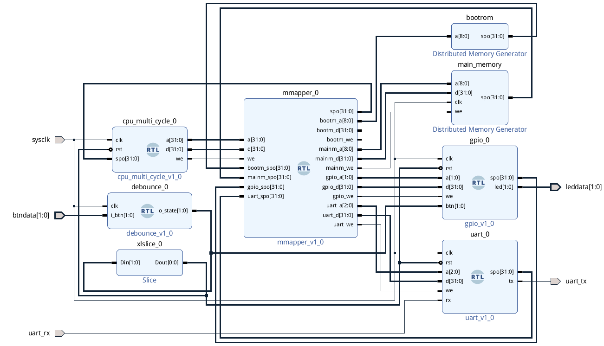
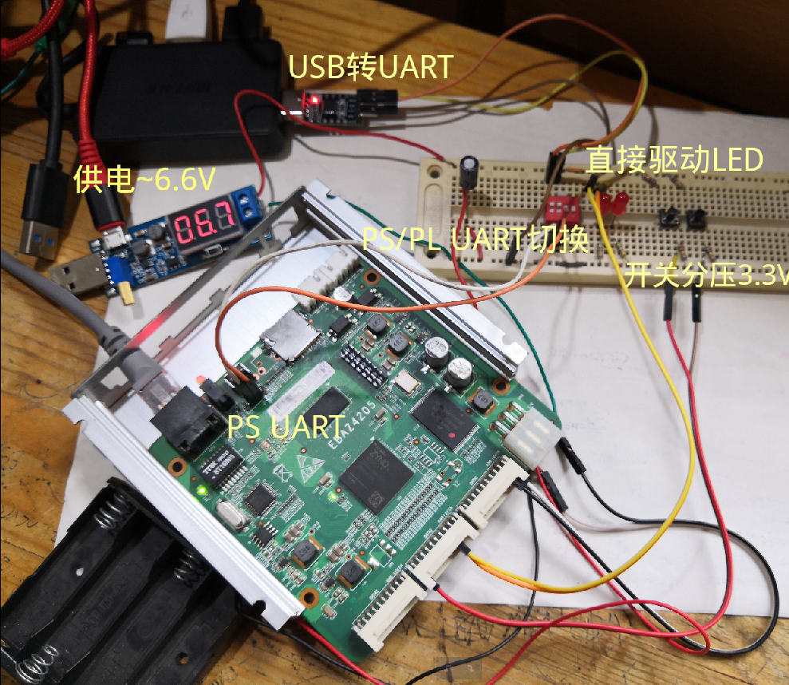

## Lab6 综合设计：UART输入输出以及ZYNQ矿机控制板改造

古宜民 PB17000002

2020.7.8

综合设计内容是UART输入输出。使用改造控制板的两个GPIO引脚作为Rx和Tx，连接USB转UART转换器，在电脑的串口上与CPU进行通信。


### 硬件设计

**多周期CPU的改进**

基于多周期CPU设计，为了方便函数调用加入了`jr`, `jal`指令，为了访问高地址加入了`lui`指令。其他大部分和原来的多周期CPU相同，只有内存模块加入了映射，外设也分配了内存地址。

**内存映射模块**

将所有外设包含在内存映射中，直接对内存地址读写就可以操作外设，而不需要CPU支持额外的指令或做其他改变。

纯组合逻辑实现，根据输入的地址`a`的高位判断属于什么设备，进而将输入的数据`d`、写使能信号`we`、以及输出`spo`分配给对应的设备。

设备包含只读ROM的bootrom、读写的分布式RAM main memory、GPIO、UART。

代码：

```verilog
`timescale 1ns / 1ps

module mmapper
    (
        input [31:0]a,
        input [31:0]d,
        //input [31:0]dpra,
        input we,
        output reg [31:0]spo,
        //output reg [31:0]dpo = 0,

        // 1024*32(4KB) boot rom: 0x00000000
        output reg [8:0]bootm_a,
        output reg [31:0]bootm_d,
        output reg bootm_we,
        input [31:0]bootm_spo,

        // main memory: 0x10000000
        output reg [8:0]mainm_a,
        output reg [31:0]mainm_d,
        output reg mainm_we,
        input [31:0]mainm_spo,

        // gpio: 0x20000000
        output reg [1:0]gpio_a,
        output reg [31:0]gpio_d,
        output reg gpio_we,
        input [31:0]gpio_spo,

        // fifo uart: 
        // write 0x30000000
        // full 0x30000004
        // empty 0x30000008
        output reg [2:0]uart_a,
        output reg [31:0]uart_d,
        output reg uart_we,
        input [31:0]uart_spo
    );

    always @ (*) begin 
        bootm_a = a[10:2];
        bootm_d = d;
        mainm_a = a[10:2];
        mainm_d = d;
        gpio_a = a[3:2];
        gpio_d = d;
        uart_a = a[4:2];
        uart_d = d;
    end

    always @ (*) begin
        bootm_we = 0;
        mainm_we = 0;
        gpio_we = 0;
        uart_we = 0;
        case (a[31:28])
            0: begin spo = bootm_spo; bootm_we = we; end
            1: begin spo = mainm_spo; mainm_we = we; end
            2: begin spo = gpio_spo; gpio_we = we; end
            3: begin spo = uart_spo; uart_we = we; end
            default: ;
        endcase
    end
endmodule
```

**GPIO**

两个按钮和两个LED，通过写和读对应的内存地址控制LED以及读取按钮的状态。为了方便映射，接口和内存一致。同样是异步读取同步写入，较为简单。reset时点亮两个LED。

代码：

```verilog
`timescale 1ns / 1ps

module gpio
    (
        input clk,
        input rst,
        input [1:0]a,
        input [31:0]d,
        input we,
        output reg [31:0]spo,

        input [1:0]btn,
        output reg [1:0]led
    );

    always @ (*) begin
        case (a)
            0: spo = {31'b0, btn[0]};
            1: spo = {31'b0, btn[1]};
            2: spo = {31'b0, led[0]};
            3: spo = {31'b0, led[1]};
            default: spo = 32'b0;
        endcase
    end

    always @ (posedge clk) begin
        if (rst) begin
            led <= 2'b11;
        end
        else if (we) begin
            case (a)
                2: led[0] <= d[0];
                3: led[1] <= d[0];
                default: ;
            endcase
        end
    end
endmodule
```

**UART**

主要设计的模块。用Verilog实现收发逻辑。通过内存读写控制收发：写`0x00`会将写入数据从UART输出，读`0x02`查看输出是否结束；写`0x01`开始接收一个字符，读`0x01`查看是否接收结束，读`0x00`获得读取的字符。

UART协议：


如图（来自Wikipedia），空闲状态为高电平，传输每个字符时分别发送一个开始位0、8个数据位、一个结束位1.

代码修改自https://github.com/jamieiles/uart，加入了读写控制的部分。

时钟生成：

115200波特率非常慢，必须用计数器手动生成。和115200之间小的偏差会在接收模块中修正。

```verilog
module baud_rate_gen
    (
        input wire clk,
        input rst,
        output wire rxclk_en,
        output wire txclk_en
    );

    parameter RX_ACC_MAX = 125000000 / (115200 * 16);
    parameter TX_ACC_MAX = 125000000 / 115200;
    parameter RX_ACC_WIDTH = 20;
    parameter TX_ACC_WIDTH = 20;
    //parameter RX_ACC_WIDTH = $clog2(RX_ACC_MAX);
    //parameter TX_ACC_WIDTH = $clog2(TX_ACC_MAX);
    reg [RX_ACC_WIDTH - 1:0] rx_acc = 0;
    reg [TX_ACC_WIDTH - 1:0] tx_acc = 0;

    assign rxclk_en = (rx_acc == 0);
    assign txclk_en = (tx_acc == 0);

    always @(posedge clk) begin
        if (rst) rx_acc <= 1;
        else if (rx_acc == RX_ACC_MAX[RX_ACC_WIDTH - 1:0])
            rx_acc <= 0;
        else
            rx_acc <= rx_acc + 1;
    end

    always @(posedge clk) begin
        if (rst) tx_acc <= 1;
        else if (tx_acc == TX_ACC_MAX[TX_ACC_WIDTH - 1:0])
            tx_acc <= 0;
        else
            tx_acc <= tx_acc + 1;
    end

endmodule
```

发送状态机：

因为异步通信，发送较为简单，收到来自`0x00`地址的写入后开始发送，结束后回到空闲状态。

```verilog
            case (state_tx) 
                IDLE: if (we & (a == 3'b000)) begin
                    data_tx <= d[7:0];
                    state_tx <= START;
                end
                START: if (txclk_en) begin
                    bitpos_tx <= 0;
                    tx <= 1'b0;
                    state_tx <= DATA;
                end
                DATA: if (txclk_en) begin
                    if (bitpos_tx == 7) state_tx <= STOP;
                    else bitpos_tx <= bitpos_tx + 1;
                    tx <= data_tx[bitpos_tx];
                end
                STOP: if (txclk_en) begin
                    tx <= 1'b1;
                    state_tx <= IDLE;
                end
                default: ;
            endcase
```

接收状态机：

接收需要检测Rx信号是否出现低电平开始位，采用过采样，用115200波特率的16倍采样，当连续读取15个低电平后认为开始数据传输。数据采集中，选择每个比特中间的第8次采样结果作为结果，这样比较稳定。采样8次（数据8个比特）后开始结束，接着读一个（结束）比特。

由于手动生成的时钟频率和115200波特率可能有小差别，手动时钟慢于发送频率时，如果还没结束时发现下一个开始信号已经到达，就直接进入开始状态继续接收，不等15次采样结束。如果快于发送时钟，会在等待开始的状态多几个周期，不需要修改代码。

```verilog
            if (we & a == 3'b001) begin
                read_enabled <= 1;
            end
            else if (rxclk_en) begin
                case (state_rx)
                    /*
                    Start counting from the first low sample, once we've
                    sampled a full bit, start collecting data bits.
                    */
                    RX_STATE_START: begin
                        //data_rx_ready <= 0;
                        if (!rx || sample != 0) sample <= sample + 1;
                        if (sample == 15) begin
                            state_rx <= RX_STATE_DATA;
                            bitpos_rx <= 0;
                            sample <= 0;
                            scratch <= 0;
                        end
                    end
                    RX_STATE_DATA: begin
                        sample <= sample + 1;
                        if (sample == 8) begin
                            scratch[bitpos_rx[2:0]] <= rx;
                            bitpos_rx <= bitpos_rx + 1;
                        end
                        if (bitpos_rx == 8 && sample == 15) state_rx <= RX_STATE_STOP;
                    end
                    /*
                     Our baud clock may not be running at exactly the
                     same rate as the transmitter.  If we thing that
                     we're at least half way into the stop bit, allow
                     transition into handling the next start bit.
                     */
                    RX_STATE_STOP: begin
                        if (sample == 15 || (sample >= 8 && !rx)) begin
                            state_rx <= RX_STATE_START;
                            data_rx <= scratch;
                            //data_rx_ready <= 1;
                            read_enabled <= 0;
                            sample <= 0;
                        end else begin
                            sample <= sample + 1;
                        end
                    end
                    default: state_rx <= RX_STATE_START;
                endcase
            end
```

这里没有对发送未结束时再次写入等特殊情况进行处理，不保证能正确发送，但是在软件的配合等待下能够保证正确。

UART速度太慢，仿真很困难，这里就没有放仿真结果。用ILA调试也不太容易，好像相比之下直接上示波器看波形稍好一点。

**Block Design**

整体连接如图：



左边为CPU、输入去抖动、数组分片将一个按钮作为reset信号，中间为内存映射、右边为bootrom、main memory、GPIO、UART。

其中，bootrom中存有程序代码，main memory作为内存不特别初始化。

### 软件设计

**使用MIPS工具链**

写汇编代码后用MIPS工具链汇编并转化为最终ROM可用的coe文件。注意要使用-EB大端，-O0禁用优化，否则针对流水线等在延迟槽中放置指令。目前这样仍然会在跳转后放nop指令，不过不影响结果。

编译指令：

```shell
mipsel-linux-gnu-as $1.asm -o $1.o -EB -O0
mipsel-linux-gnu-as ./mylib/mylib.asm -o mylib.o -EB -O0

mipsel-linux-gnu-ld -nostdlib --script linker.ld mylib.o $1.o -o $1.elf -EB
mipsel-linux-gnu-objcopy -O binary $1.elf $1.bin
cat > result_$1.coe << EOF
memory_initialization_radix  = 16;
memory_initialization_vector =
EOF
xxd -c 4 -p $1.bin >> result_$1.coe
```

链接脚本：

```ld
SECTIONS
{
    . = 0x0;
    .text : { *(.text.boot) }
    .text : { *(.text) }
    .data : { *(.data) }

    /DISCARD/ : { *(.comment) *(.gnu*) *(.note*) *(.eh_frame*) *(.reginfo) *(.MIPS.abiflags) *(.pdr)}
}
```

输入输出“库”：

配合UART硬件，写入/读取内存地址并等待传输结束。GPIO只要直接写入值即可。

```asm
.text

.globl uart_putchar
.globl uart_getchar
.globl led_ctrl

# void uart_putchar(char c)
uart_putchar:
    lw $t2, uart_addr
_uart_putchar_wait1:
    lw $t0, 8($t2)
    beq $t0, $0, _uart_putchar_wait1
    sw $a0, 0($t2) # do the real work
_uart_putchar_wait2:
    lw $t0, 8($t2)
    beq $t0, $0, _uart_putchar_wait2
    jr $ra

# char uart_getchar()
uart_getchar:
    lw $t2, uart_addr
    addi $t1, $0, 1
    sw $t1, 4($t2)
_loop_uart_getchar:
    lw $t0, 4($t2)
    beq $t0, $0, _loop_uart_getchar
    lw $t0, 0($t2)
    addi $v0, $t0, 0
    jr $ra

# void gpio_addr(int a)
led_ctrl:
    lw $t2, gpio_addr
    addi $t1, $t2, 8
    sw $a0, 0($t1)
    addi $t1, $t2, 12
    sw $a0, 0($t1)
    jr $ra

.data
    uart_addr: .word 0x30000000
    gpio_addr: .word 0x20000000
```

示例程序：

简单地测试所实现的功能。测试程序开始运行输出`OK`并熄灭LED，之后读字符串，读一个字符输出一个`.`，读到回车（`\r`）换行并输出所读的一行字符串。用内存存储读到的字符串。

```asm
.section .text.boot

_start:
    addi $a0, $zero, 0
    jal led_ctrl
    addi $a0, $zero, 'O'
    jal uart_putchar
    addi $a0, $zero, 'K'
    jal uart_putchar
    lw $s0, mem_addr
_input:
    addi $a0, $zero, '\r'
    jal uart_putchar
    addi $a0, $zero, '\n'
    jal uart_putchar
    addi $s1, $zero, 0 # loop variable
_loop_input:
    jal uart_getchar
    add $t0, $s0, $s1
    sw $v0, 0($t0)
    addi $t0, $zero, '\r'
    beq $v0, $t0, _print
    addi $a0, $zero, '.'
    jal uart_putchar
    addi $s1, $s1, 4
    j _loop_input
_print:
    addi $a0, $zero, '\r'
    jal uart_putchar
    addi $a0, $zero, '\n'
    jal uart_putchar
    addi $s1, $zero, 0
_loop_print:
    add $t0, $s0, $s1
    lw $a0, 0($t0)
    jal uart_putchar
    addi $t0, $zero, '\r'
    beq $a0, $t0, _input
    addi $s1, $s1, 4
    j _loop_print

.text 
    mem_addr: .word 0x10000000
```

### ZYNQ矿机控制板改造

说明一下进行实验的平台。尝试一下追求极致性价比，选择了闲鱼上泛滥的翼比特矿机控制板ebaz4205，40元入手。其搭载常用于嵌入式开发的ZYNQ7010芯片，包含双核ARM Cortex A9处理器和Artix 7可编程逻辑。这里只使用可编程逻辑（PL），对处理器（PS）只用于比特流烧写和必要的配置，并没有使用现成的处理器“作弊”。

在我的[这篇博客](https://www.ustcpetergu.com/MyBlog/experience/2020/07/01/ebaz-4205.html)中介绍了一些细节和参考资料，这里就不再说了。

板子上除了GPIO几乎没有直接在PL中能用的资源，所以从GPIO引出了几个LED和开关，用于调试和reset信号。

开发流程为：使用板子NAND中自带的uboot启动，焊上UART排针后通过UART和板子通信，用网线连接板子和电脑，在uboot中使用tftp从电脑下载比特流并烧写。

注意这个UART是挂在PS上的，仅用于调试，不是实验中我自己写的PL上的UART。因为我只有一个USB转UART，所以用拨动开关切换一下。

CPU频率能跑到125MHz，表明没有严重影响时钟的设计失误。

setup图片：



展示了完整流程的测试视频：

http://home.ustc.edu.cn/~guyimin/Legacy/part1.mp4

http://home.ustc.edu.cn/~guyimin/Legacy/part2.mp4


### 总结

本次实验还是有一定难度的，硬件方面也“踩坑”不少，比如UART排针虚焊了好几次，经常接触不良，买了一个很便宜的下载器结果发现是Altera的，这个板子用不了，等等。对于UART，确实没有找到什么好的调试方法，但只要第一个能用的版本写出来了后面再改就快一些了。

完整代码在http://home.ustc.edu.cn/~guyimin/Legacy/lab6.tar.gz

sha1:8b8d1b900451cbd23330eefc1455f339e9dff013